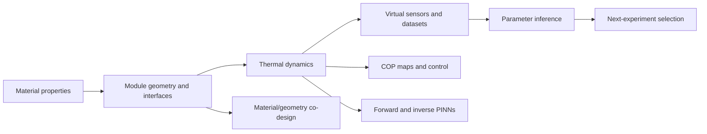

# ThermoTwin

ThermoTwin is a physics-informed digital twin and experiment-planning toolkit
for a modular thermoelectric heat pump. It connects material properties,
geometry, interfaces, drive electronics, sensors, inference, and control to the
device-level quantities an engineer ultimately cares about: delivered heat,
temperature lift, electrical power, and coefficient of performance (COP).

The conventional physics kernel is dependency-free Python. Optional reports use
Matplotlib and optional physics-informed neural networks (PINNs) use PyTorch.
The package has extensive synthetic validation, but **it has not yet been
validated against hardware**.

For equations, implementation details, and full reproduction instructions, see
[`thermotwin/README_detailed.md`](thermotwin/README_detailed.md).

---

## Why this project exists

A promising thermoelectric material does not automatically make a good heat
pump. Module geometry, thermal and electrical interfaces, heat exchangers,
current limits, converter losses, sensors, and the intended operating condition
can erase or amplify the material-level advantage. ThermoTwin keeps those layers
connected so that a design or experiment can be judged at the system level.



### Important materials boundary

Material properties are **inputs**, not predictions. ThermoTwin does not infer
what Seebeck coefficient, electrical conductivity, or thermal conductivity a
dopant, sintering route, or lattice will produce. It prices a supplied property
set at the module and device levels, where geometry, interfaces, electronics,
and application constraints determine whether the material advantage survives.

## What ThermoTwin can answer

| Engineering question | Reproducible walkthrough |
| --- | --- |
| What COP is available at a given current and temperature lift? | [COP operating map](thermotwin/COP_OPERATING_MAP_EXPERIMENT.md) |
| How much efficiency do thermal contacts consume at equal delivered cooling? | [COP operating map](thermotwin/COP_OPERATING_MAP_EXPERIMENT.md) |
| What does direct PWM cost compared with smoothed current or ideal DC? | [PWM power electronics](thermotwin/PWM_POWER_ELECTRONICS_EXPERIMENT.md) |
| Does seconds-scale pulsing beat continuous current at equal cooling? | [Pulse operating map](thermotwin/PULSE_OPERATING_MAP_EXPERIMENT.md) and [control comparison](thermotwin/CONTROL_COMPARISON_EXPERIMENT.md) |
| Can hidden contact resistance be inferred from sparse temperature sensors? | [Contact-resistance inference](thermotwin/CONTACT_RESISTANCE_EXPERIMENT.md) and [sparse sensors](thermotwin/SPARSE_SENSOR_EXPERIMENT.md) |
| Which sensor locations and current pulse are most informative? | [Next-experiment selection](thermotwin/NEXT_EXPERIMENT_WALKTHROUGH.md) |
| Can finished assemblies be ranked by hidden interface quality? | [Assembly fingerprinting](thermotwin/ASSEMBLY_FINGERPRINT_EXPERIMENT.md) |
| What does a PINN add beyond a conventional solver? | [PINN showcase](thermotwin/PINN_SHOWCASE.md) |
| How should material choice and leg geometry change with the application? | [Material/geometry co-design](thermotwin/MATERIAL_GEOMETRY_BAYESIAN_CODESIGN.md) |
| What electrical contact resistivity must a process achieve for a chosen leg length and application? | [Electrical-contact process window](thermotwin/ELECTRICAL_CONTACT_PROCESS_WINDOW.md) |
| Does a published Ag₂Se n leg improve the same designs when everything else is held fixed? | [Matched Ag₂Se substitution](thermotwin/AG2SE_SUBSTITUTION_EXPERIMENT.md) |
| What would a real hardware comparison require? | [Hardware-validation protocol](thermotwin/HARDWARE_VALIDATION_PROTOCOL.md) |

---

## Quick start

From the repository root, install the package in editable mode:

```bash
python3 -m pip install -e .
```

Install all optional report and PINN dependencies:

```bash
python3 -m pip install -e '.[all]'
```

Run the complete test suite:

```bash
python3 -m unittest discover -s tests
```

Start with the two broadest reports:

```bash
thermotwin-engineering-showcase
thermotwin-codesign
```

Installed command | Equivalent module command
--- | ---
`thermotwin-engineering-showcase` | `python3 -m thermotwin.engineering_showcase`
`thermotwin-codesign` | `python3 -m thermotwin.material_geometry_codesign_report`
`thermotwin-cop-map` | `python3 -m thermotwin.cop_operating_map_report`
`thermotwin-pwm` | `python3 -m thermotwin.pwm_power_electronics_report`
`thermotwin-pulse-map` | `python3 -m thermotwin.pulse_operating_map_report`
`thermotwin-contact-report` | `python3 -m thermotwin.contact_report`
`thermotwin-pinn-showcase` | `python3 -m thermotwin.pinn_showcase`
`thermotwin-dataset-quality` | `python3 -m thermotwin.dataset_quality`
`thermotwin-contact-process-window` | `python3 -m thermotwin.contact_process_window`
`thermotwin-ag2se-substitution` | `python3 -m thermotwin.ag2se_substitution`

Reports write reproducible images to `thermotwin/figures/` by default. That
directory is ignored by Git. Most report commands accept `--output PATH` when a
different destination is useful.

Importing the core package does not import PyTorch or Matplotlib.

---

## Results at a glance

These are synthetic, model-based results. The linked walkthroughs own the full
conditions, assumptions, and interpretation.

### Physics-informed modeling

| Result | Value |
| --- | ---: |
| Physics-only four-state forward PINN, worst state RMSE | 0.009327 K |
| Temperature labels used by that forward PINN | 0 |
| Inverse PINN estimate of a hidden 0.25 K/W contact resistance | 0.250519 K/W |
| Inverse PINN parameter error | 0.208% |
| Withheld-schedule RMSE after transferring the inferred parameter through the trusted solver | 0.000322 K validation; 0.000534 K bipolar test |

The conventional scalar optimizer is more accurate on this small ideal problem:
it recovers 0.250000002 K/W in 42 loss evaluations. The PINN result matters not
because it beats that optimizer, but because one differentiable representation
combines governing equations, partial observations, positive parameters, hidden
states, and switched controls.

### Sensors, inference, and experiment design

| Result | Value |
| --- | ---: |
| Local information from the cold sensor pair versus the hot pair | 304.9 vs 1.94, about 157× |
| Inferred resistance after an unmodeled +0.10 K cold-face bias | 0.2089 K/W, 16.4% low |
| Selected feasible pulse | 0.8 A for 20 s, starting at 5 s |
| Expected information gain of selected versus naive pulse | 7.198 vs 2.889 nats |
| Joint log-parameter RMSE reduction in 250 linearized noise trials | 82.2% |

The central lesson is that transient placement and sensor location can matter
more than simply collecting more samples.

### Efficiency, electronics, and co-design

| Result | Value |
| --- | ---: |
| Contact-aware versus reduced-model COP penalty at equal 3 W cooling | 19–35% over the feasible 0–25 K lift range |
| Direct rectangular PWM Joule multiplier at fixed mean current and duty `D` | exactly `1 / D` |
| Cooling-COP penalty at a 5 W target: 75% duty to 99% duty | 24.23% to 0.90% |
| 25 K co-design utility: Bayesian optimization versus random-search median | 6.4268 vs 3.9015 |
| Bayesian-optimization improvement on either 10 K application | none; the initial screen already contained the tested-pool winner |
| Requirement pass rate of the nominal 10 K efficiency winner under assumed as-built spread | 55.3% |
| [Published-unicouple electrical contact translation](thermotwin/ELECTRICAL_CONTACT_PROCESS_WINDOW.md) | 50% crossover at $1.1069\times10^{-8}$ Ω·m²; paper-derived point is 60.07% contact resistance and 39.93% zero-contact $ZT$ retention |

The final two results are deliberately uncomfortable. Reporting the null
optimization result avoids inventing value where the initial design already
won, and the 55.3% pass rate shows that optimizing nominal COP can select a
design that is difficult to manufacture reliably.

The matched Ag₂Se extension is similarly candid: it improves the utility of
most fixed designs at the good-interface baseline but does not create a new
best feasible design in any application. The process-window and substitution
walkthroughs separate that material result from interface quality and geometry.

---

## Physics in one page

For cold and hot thermoelectric face temperatures `T_c` and `T_h`, current `I`,
effective Seebeck coefficient `alpha`, electrical resistance `R`, and parasitic
thermal conductance `K`:

```text
Q_c = alpha I T_c - 0.5 I^2 R - K(T_h - T_c)
Q_h = alpha I T_h + 0.5 I^2 R - K(T_h - T_c)
V   = alpha(T_h - T_c) + I R
```

`Q_c > 0` means heat is removed from the cold face; `Q_h > 0` means heat is
delivered to the hot face. The module energy identity is

```text
Q_h - Q_c = V I.
```

Peltier transport grows linearly with current, while Joule heat grows with the
current squared. More current therefore cannot improve cooling indefinitely.
At zero current, only passive hot-to-cold conduction remains.

The two-node transient model attaches thermal capacitances and reservoir links
directly to the two module faces. The contact-aware four-node model separates
the module faces from the exchanger nodes, making interface temperature drops
and hidden contact resistance explicit. Use the two-node model when contacts
are intentionally omitted; no zero-resistance workaround is required.

---

## Model and software layers

```text
thermotwin/
├── core/          current-control types shared across the package
├── physics/       thermoelectric relations, balances, steady states, RK4 solvers
├── numerics/      interpolation, discontinuous-power integration, matrices, statistics
├── simulation/    frozen experiments and diagnostic histories
├── observations/  sensors, noise, bias, lag, dropout, provenance, data quality
├── inference/     parameter estimation, identifiability, experiment selection
├── studies/       repeatable robustness campaigns
├── design/        COP maps, controls, electronics, and material/geometry co-design
├── pinn/          optional forward and inverse PINNs
└── reports/       command-line reports and figures
```

New code should use the layered imports:

```python
from thermotwin.physics import ThermoelectricParameters, cold_side_heat
from thermotwin.core.controls import PiecewiseConstantCurrent
from thermotwin.design.codesign import CodesignCampaignConfig
```

Older public module paths remain as compatibility facades. The dependency rules
and extension pattern are documented in
[`docs/thermotwin/ARCHITECTURE.md`](docs/thermotwin/ARCHITECTURE.md).

---

## How the evidence is checked

The current suite contains 392 tests. It covers:

- units, signs, algebraic identities, and positive/zero/negative current;
- limiting cases such as passive conduction and absent identifiability;
- RK4 step refinement, exact handling of known current switches, long-time
  agreement with independent steady-state equations, and graceful divergence
  detection;
- decreasing four-node/two-node disagreement as contact resistance is reduced;
- observation timing, noise seeds, bias, first-order lag, missing records,
  provenance, and split isolation;
- parameter recovery, local information, uncertainty coverage, and withheld
  operating regimes;
- PINN residual signs, exact initial conditions, exact segment continuity, and
  comparison with withheld conventional trajectories;
- report generation and stable command-line entry points.

This hierarchy matters. Agreement between a PINN and the conventional solver
shows that the network approximates the stated equations. Same-model inverse
recovery shows that the inference machinery works when its assumptions are
true. Neither result shows that those equations match a physical device.

---

## Known limitations

- No hardware dataset has been used.
- Material properties are constant with temperature and current.
- The thermoelectric module is quasi-steady and lumped; Thomson heating,
  radiation, and distributed temperature fields are omitted.
- Material properties are inputs. There is no process-to-property model for
  doping, sintering, or lattice design.
- Most inverse results use data generated by the same model used for fitting.
- Current is scalar or piecewise constant. The PWM layer is thermally averaged,
  not a switching-converter circuit simulation.
- The co-design cost index and manufacturing spreads are declared synthetic
  assumptions, not supplier quotes or measured process capability.

See [the detailed assumptions](thermotwin/README_detailed.md#11-assumptions-and-limits)
before using any result as a design claim.

---

## Where the project stands

The scientific specification, conventional solvers, virtual test stand, and
current generic control comparison are complete for their documented scopes.
Forward PINNs, inverse inference, identifiability, next-experiment selection,
and the research artifact have strong implemented foundations but still have
explicit exit criteria remaining. Hardware validation is optional and has not
started.

The authoritative status and remaining work are in
[`thermotwin/ROADMAP.md`](thermotwin/ROADMAP.md).

## Reading and learning paths

- [`thermotwin/README_detailed.md`](thermotwin/README_detailed.md) — complete technical guide,
  reproducibility map, API examples, milestones, and glossary.
- [`thermotwin/PINN_SHOWCASE.md`](thermotwin/PINN_SHOWCASE.md) — the most direct demonstration of the
  learned model.
- [`thermotwin/MATERIAL_GEOMETRY_BAYESIAN_CODESIGN.md`](thermotwin/MATERIAL_GEOMETRY_BAYESIAN_CODESIGN.md)
  — the application and commercialization-facing design study.
- [`thermotwin/HARDWARE_VALIDATION_PROTOCOL.md`](thermotwin/HARDWARE_VALIDATION_PROTOCOL.md) — the
  boundary between synthetic evidence and a physical claim.

## Scope statement

ThermoTwin models a generic thermoelectric heat pump using public equations and
published material data. It does not reproduce proprietary hardware.

## License

ThermoTwin's original code and documentation are available under the
[MIT License](LICENSE). Third-party datasets, literature-derived records, and
publication content retain their respective licenses and attribution
requirements; source-specific provenance is documented with each study.
