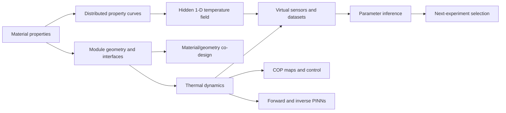

# ThermoTwin

ThermoTwin is a physics-informed digital twin and experiment-planning toolkit
for a modular thermoelectric heat pump. It connects material properties,
geometry, interfaces, drive electronics, sensors, inference, and control to the
device-level quantities an engineer ultimately cares about: delivered heat,
temperature lift, electrical power, and coefficient of performance (COP).

The conventional physics kernel is dependency-free Python. Optional reports use
Matplotlib and optional physics-informed neural networks (PINNs) use PyTorch.
The package has extensive synthetic validation, but **it has not yet been
validated against hardware**.

For equations, implementation details, and full reproduction instructions, see
[`thermotwin/README_detailed.md`](thermotwin/README_detailed.md).

---

## Why this project exists

A promising thermoelectric material does not automatically make a good heat
pump. Module geometry, thermal and electrical interfaces, heat exchangers,
current limits, converter losses, sensors, and the intended operating condition
can erase or amplify the material-level advantage. ThermoTwin keeps those layers
connected so that a design or experiment can be judged at the system level.



### Important materials boundary

Material properties are **inputs**, not predictions. ThermoTwin does not infer
what Seebeck coefficient, electrical conductivity, or thermal conductivity a
dopant, sintering route, or lattice will produce. It prices a supplied property
set at the module and device levels, where geometry, interfaces, electronics,
and application constraints determine whether the material advantage survives.

## What ThermoTwin can answer

| Engineering question | Reproducible walkthrough |
| --- | --- |
| What COP is available at a given current and temperature lift? | [COP operating map](thermotwin/COP_OPERATING_MAP_EXPERIMENT.md) |
| How much efficiency do thermal contacts consume at equal delivered cooling? | [COP operating map](thermotwin/COP_OPERATING_MAP_EXPERIMENT.md) |
| What does direct PWM cost compared with smoothed current or ideal DC? | [PWM power electronics](thermotwin/PWM_POWER_ELECTRONICS_EXPERIMENT.md) |
| Does seconds-scale pulsing beat continuous current at equal cooling? | [Pulse operating map](thermotwin/PULSE_OPERATING_MAP_EXPERIMENT.md) and [control comparison](thermotwin/CONTROL_COMPARISON_EXPERIMENT.md) |
| Can hidden contact resistance be inferred from sparse temperature sensors? | [Contact-resistance inference](thermotwin/CONTACT_RESISTANCE_EXPERIMENT.md) and [sparse sensors](thermotwin/SPARSE_SENSOR_EXPERIMENT.md) |
| Which sensor locations and current pulse are most informative? | [Next-experiment selection](thermotwin/NEXT_EXPERIMENT_WALKTHROUGH.md) |
| Does the selected pulse still win after complete nonlinear refitting? | [Nonlinear experiment-selection validation](thermotwin/NONLINEAR_EXPERIMENT_SELECTION.md) |
| Can an inverse PINN recover contact resistance with noise and missing turn-off data? | [Imperfect-observation inverse PINN](thermotwin/IMPERFECT_INVERSE_PINN.md) |
| Can finished assemblies be ranked by hidden interface quality? | [Assembly fingerprinting](thermotwin/ASSEMBLY_FINGERPRINT_EXPERIMENT.md) |
| What does a PINN add beyond a conventional solver? | [PINN showcase](thermotwin/PINN_SHOWCASE.md) |
| Does physics improve reconstruction when exchanger data are sparse and missing at turn-off? | [Matched forward reconstruction](thermotwin/FORWARD_RECONSTRUCTION_COMPARISON.md) |
| How should material choice and leg geometry change with the application? | [Material/geometry co-design](thermotwin/MATERIAL_GEOMETRY_BAYESIAN_CODESIGN.md) |
| What electrical contact resistivity must a process achieve for a chosen leg length and application? | [Electrical-contact process window](thermotwin/ELECTRICAL_CONTACT_PROCESS_WINDOW.md) |
| Does a published Ag₂Se n leg improve the same designs when everything else is held fixed? | [Matched Ag₂Se substitution](thermotwin/AG2SE_SUBSTITUTION_EXPERIMENT.md) |
| Can terminal measurements recover temperature-dependent properties and a hidden internal field? | [Distributed constitutive inference](thermotwin/DISTRIBUTED_CONSTITUTIVE_INFERENCE.md) |
| Does distributed resistivity recovery repeat under measurement noise and new neural initializations? | [Noisy multi-seed distributed inverse](thermotwin/DISTRIBUTED_INVERSE_ROBUSTNESS.md) |
| Does a small inverse-PINN knot error also mean the PDE and curve shape converged? | [Distributed inverse-PINN training audit](thermotwin/DISTRIBUTED_PINN_TRAINING_AUDIT.md) |
| Does a noisy distributed inverse recover a complete operating regime withheld from fitting? | [Withheld-regime transfer validation](thermotwin/DISTRIBUTED_WITHHELD_VALIDATION.md) |
| Can the sensors and current regimes actually support a unique distributed resistivity curve? | [Distributed observation-sufficiency gate](thermotwin/DISTRIBUTED_OBSERVATION_IDENTIFIABILITY.md) |
| Do nominal distributed-resistivity intervals contain independent synthetic truth at the advertised rate? | [Nonlinear profiles and repeated coverage](thermotwin/DISTRIBUTED_PROFILE_COVERAGE.md) |
| What would a real hardware comparison require? | [Hardware-validation protocol](thermotwin/HARDWARE_VALIDATION_PROTOCOL.md) |
| Where can I see the main engineering workflows together? | [Engineering decision showcase](thermotwin/ENGINEERING_SHOWCASE.md) |

---

## Quick start

From the repository root, install the package in editable mode:

```bash
python3 -m pip install -e .
```

Install all optional report and PINN dependencies:

```bash
python3 -m pip install -e '.[all]'
```

Run the complete test suite:

```bash
python3 -m unittest discover -s tests
```

Start with the two broadest reports:

```bash
thermotwin-engineering-showcase
thermotwin-codesign
```

Installed command | Equivalent module command
--- | ---
`thermotwin-engineering-showcase` | `python3 -m thermotwin.engineering_showcase`
`thermotwin-generate-figures` | `python3 -m thermotwin.generate_all_figures`
`thermotwin-control-comparison` | `python3 -m thermotwin.control_comparison_report`
`thermotwin-assembly-fingerprint` | `python3 -m thermotwin.assembly_fingerprint_report`
`thermotwin-next-experiment` | `python3 -m thermotwin.experiment_selection_report`
`thermotwin-nonlinear-experiment` | `python3 -m thermotwin.nonlinear_experiment_selection`
`thermotwin-imperfect-inverse-pinn` | `python3 -m thermotwin.imperfect_inverse_pinn`
`thermotwin-forward-reconstruction` | `python3 -m thermotwin.forward_reconstruction_comparison`
`thermotwin-sparse-sensors` | `python3 -m thermotwin.sparse_sensor_report`
`thermotwin-codesign` | `python3 -m thermotwin.material_geometry_codesign_report`
`thermotwin-cop-map` | `python3 -m thermotwin.cop_operating_map_report`
`thermotwin-pwm` | `python3 -m thermotwin.pwm_power_electronics_report`
`thermotwin-pulse-map` | `python3 -m thermotwin.pulse_operating_map_report`
`thermotwin-contact-report` | `python3 -m thermotwin.contact_report`
`thermotwin-pinn-showcase` | `python3 -m thermotwin.pinn_showcase`
`thermotwin-dataset-quality` | `python3 -m thermotwin.dataset_quality`
`thermotwin-contact-process-window` | `python3 -m thermotwin.contact_process_window`
`thermotwin-ag2se-substitution` | `python3 -m thermotwin.ag2se_substitution`
`thermotwin-distributed-properties` | `python3 -m thermotwin.distributed_property_report`
`thermotwin-distributed-robustness` | `python3 -m thermotwin.distributed_inverse_robustness`
`thermotwin-distributed-withheld` | `python3 -m thermotwin.distributed_withheld_validation`
`thermotwin-distributed-independent` | `python3 -m thermotwin.distributed_independent_validation`
`thermotwin-distributed-identifiability` | `python3 -m thermotwin.distributed_observation_identifiability`
`thermotwin-distributed-profile-coverage` | `python3 -m thermotwin.distributed_profile_coverage`
`thermotwin-distributed-pinn-audit` | `python3 -m thermotwin.distributed_pinn_training_audit`

Reports group reproducible artifacts under a folder named after the associated
walkthrough, such as
`thermotwin/figures/COP_OPERATING_MAP_EXPERIMENT/`. Each figure receives a
same-stem JSON file containing the report data used to build it and a TXT file
explaining the panels and interpretation boundary. The complete
`thermotwin/figures/` tree is ignored by Git. Most commands accept
`--output PATH`; both sidecars follow that custom figure path. See the
[generated-artifact index](thermotwin/figures/README.md) for the complete
folder map.

Importing the core package does not import PyTorch or Matplotlib.

---

## Results at a glance

These are synthetic, model-based results. The linked walkthroughs own the full
conditions, assumptions, and interpretation.

### Physics-informed modeling

| Result | Value |
| --- | ---: |
| Physics-only four-state forward PINN, worst state RMSE | 0.009327 K |
| Temperature labels used by that forward PINN | 0 |
| Inverse PINN estimate of a hidden 0.25 K/W contact resistance | 0.250519 K/W |
| Inverse PINN parameter error | 0.208% |
| Withheld-schedule RMSE after transferring the inferred parameter through the trusted solver | 0.000322 K validation; 0.000534 K bipolar test |
| Imperfect-data inverse-PINN passes for expected noisy/missing cases | 9/9 across three initial guesses |
| Matched sparse/missing reconstruction, physics-informed vs data-only hidden-face RMSE | 0.007105 K vs 2.193724 K |
| Independent whole-system energy-rate closure RMS | 0.132833 W vs 16.493587 W |

The conventional scalar optimizer is more accurate on this small ideal problem:
it recovers 0.250000002 K/W in 42 loss evaluations. The PINN result matters not
because it beats that optimizer, but because one differentiable representation
combines governing equations, partial observations, positive parameters, hidden
states, and switched controls.

The matched forward-reconstruction study gives identically initialized
1,116-parameter networks the same 56 noisy exchanger-temperature rows, with
both sensors absent around current turn-off. The data-only model fits retained
noisy rows slightly better and trains about 3.8 times faster. The
physics-informed model instead reduces missing-interval exchanger RMSE by
87.86%, completely hidden-face RMSE by 99.68%, and whole-system energy-rate
imbalance by 99.19%; all three advantages hold in 5/5 trials. The post-training
energy calculation is not a fifth loss or a new physical law—it independently
evaluates the first-law consequence of the four node balances in watts and
joules. See the [matched comparison](thermotwin/FORWARD_RECONSTRUCTION_COMPARISON.md).

The imperfect-observation follow-on adds 0.02 K Gaussian noise, removes both
cold sensor channels around current turn-off, and combines those effects. The
inverse PINN passes all nine expected-recovery trials from 0.15, 0.50, and
0.80 K/W initial guesses, with complete validation and bipolar schedules held
out. The conventional scalar fit remains more accurate. An intentionally
unmodeled +0.10 K cold-face bias is the caution: every PINN run reduces loss by
about 99.99%, but aggregate parameter RMSE is 0.035184 K/W and one run fails
the parameter and bipolar-transfer gates. See the [imperfect-data inverse-PINN
walkthrough](thermotwin/IMPERFECT_INVERSE_PINN.md).

The [distributed constitutive-inference study](thermotwin/DISTRIBUTED_CONSTITUTIVE_INFERENCE.md)
moves beyond those lumped ODEs. A conservative 1-D finite-volume model stores
energy inside a temperature-dependent leg, and a PDE PINN reconstructs the
hidden field without finite-volume temperature labels. In the frozen CPU case,
the forward distributed PINN reaches 0.006420 K internal-field RMSE and 0.015116
K maximum error. A local observation-first gate is full rank for three knots of
each of `alpha(T)`, `rho_e(T)`, and `kappa(T)` under the declared synthetic
sensor precision, but the resistivity curve is substantially less well
conditioned than the other families. This is a local synthetic result, not a
hardware identifiability claim. Independent noise-free inverse-PINN checks now
release each curve separately. The maximum knot-multiplier errors are about
0.0165 for `alpha(T)` and 0.0180 for `rho_e(T)`. Conductivity is the cautionary
case: with face temperatures and voltage alone, the frozen inverse PINN does
not recover `kappa(T)` reliably; adding idealized cold- and hot-side heat-rate
observations reduces its maximum error to about 0.0515. The conventional
same-model estimator recovers all declared truths essentially exactly, so
these are optimizer results rather than evidence that the terminal observation
model lacks conductivity information.

In the follow-on noisy five-seed resistivity study, the inverse PINN passes the
broad knot-and-observation recovery gate in 5/5 trials with 0.0254 worst-case
knot error; the unregularized conventional fit passes 2/5 with 0.2113
worst-case error. A later training audit narrows that interpretation. At the
frozen 600 epochs, the inverse PINN's mean curve amplitude is only 38% of truth
and its physical residual RMS is 76.25% of the nominal temperature-rate RMS.
At the unchanged 2,400-epoch budget, increasing the physics-loss weight from 1
to 10 reduces mean residual ratio from 49.35% to 21.17% and mean observation
loss from 1.1131 to 0.8201. All 3/3 seeds then pass the truth-blind operational
gate, while only 2/3 recover the declared curve shape. The correction
demonstrates improved physics/observation convergence without overstating
unique function recovery. See the [training and curve-shape
audit](thermotwin/DISTRIBUTED_PINN_TRAINING_AUDIT.md).

The next transfer check withholds one complete 20 K, +0.4 A regime from every
fit, freezes the inferred curve, and scores the resulting noise-free prediction
including hidden internal temperatures and terminal voltage. Across five fixed
noise/neural seed trials, the inverse PINN passes all six prediction criteria in
5/5 trials; the conventional unregularized fit passes 2/5 because its voltage
error exceeds the fixed limit in three trials. Only the voltage criterion
binds; the temperature and hidden-field limits are much looser, and energy
closure is guaranteed by the conservative prediction solver. This validates
predictive equivalence in one within-model regime, not recovery of the true
property curve or extrapolation to a new material law or hardware. See the [withheld-regime
walkthrough](thermotwin/DISTRIBUTED_WITHHELD_VALIDATION.md).

The next benchmark removes the exact numerical/property-basis inverse crime:
truth uses a 25-node nodal discretization, SSPRK3, and a smooth cubic
`rho_e(T)`, while both inference methods retain the established finite-volume
and three-knot model. It also compares unregularized and identically weighted
curvature-penalty versions of both estimators. Across three paired noisy
trials, both PINN variants pass the in-support property-and-transfer gate in
3/3 trials; both conventional variants pass 1/3. Matching the explicit penalty
does not explain the PINN's stability and does not make the estimators fully
equivalent because implicit neural and field regularization remain. This is a
small synthetic model-mismatch result, not a failure-rate or hardware claim.
See the [independent-truth walkthrough](thermotwin/DISTRIBUTED_INDEPENDENT_VALIDATION.md).

The observation-sufficiency follow-on deliberately removes informative current
regimes and sensors before fitting. With the frozen 0.01 K/10 microvolt noise
model, the full zero/positive/negative-current temperature-plus-voltage set
supports 3/3 local resistivity-curve directions. Zero current supports exactly
0/3, positive-current temperatures support 0/3 under the practical gate, and
positive-current temperatures plus voltage support 2/3. The last case is the
important warning: the PINN still returns a stable, accurate-looking synthetic
curve, but ThermoTwin rejects it because optimizer stability cannot replace a
missing information direction. See the [observation-sufficiency
walkthrough](thermotwin/DISTRIBUTED_OBSERVATION_IDENTIFIABILITY.md).

The interval follow-on fixes one resistivity coefficient at a time and
re-optimizes the other two to expose representative nonlinear profile shapes.
It then repeats fresh multistart fits against independent nodal/SSPRK3/cubic
truth. Across 20 conventional trials, unregularized local intervals cover
63.3% of individual coefficients at the nominal 68% level and 98.3% at the
nominal 95% level; matched shrinkage-plus-curvature intervals cover 78.3% and
100%, respectively. These 60 coefficient checks per estimator have wide
binomial uncertainty. The explicit prior lowers mean continuous-property RMSE
from 8.46% to 5.07%. The ten paired PINNs reach about 1.75% point-estimate RMSE,
but ThermoTwin does not infer neural uncertainty from seed spread. See the
[nonlinear-profile and coverage walkthrough](thermotwin/DISTRIBUTED_PROFILE_COVERAGE.md).

### Sensors, inference, and experiment design

| Result | Value |
| --- | ---: |
| Local information from the cold sensor pair versus the hot pair | 304.9 vs 1.94, about 157× |
| Inferred resistance after an unmodeled +0.10 K cold-face bias | 0.2089 K/W, 16.4% low |
| Selected feasible pulse | 0.8 A for 20 s, starting at 5 s |
| Expected information gain of selected versus naive pulse | 7.198 vs 2.889 nats |
| Joint log-parameter RMSE reduction in 250 linearized noise trials | 82.2% |
| Joint log-parameter RMSE reduction after 20 complete nonlinear refits | 81.46% versus naive; 11.77% versus closest-energy control |

The complete nonlinear follow-on varies contact resistance, face capacitance,
sensor lag, two nuisance biases, and noise. The selected pulse supports all
3/3 local directions while zero current supports 0/3. Its local intervals cover
98.3% of individual parameters and 95.0% of all three simultaneously in the
20-trial campaign. The central lesson is that transient placement and sensor
location can matter more than simply collecting more samples, while the
remaining absolute correlations—0.9331 for contact/capacitance, 0.7435 for
contact/lag, and 0.5611 for capacitance/lag—prevent an independence claim. See
the [nonlinear validation](thermotwin/NONLINEAR_EXPERIMENT_SELECTION.md).

### Efficiency, electronics, and co-design

| Result | Value |
| --- | ---: |
| Contact-aware versus reduced-model COP penalty at equal 3 W cooling | 19–35% over the feasible 0–25 K lift range |
| Direct rectangular PWM Joule multiplier at fixed mean current and duty `D` | exactly `1 / D` |
| Cooling-COP penalty at a 5 W target: 75% duty to 99% duty | 24.23% to 0.90% |
| 25 K co-design utility: Bayesian optimization versus random-search median | 6.4268 vs 3.9015 |
| Bayesian-optimization improvement on either 10 K application | none; the initial screen already contained the tested-pool winner |
| Requirement pass rate of the nominal 10 K efficiency winner under assumed as-built spread | 55.3% |
| [Published-unicouple electrical contact translation](thermotwin/ELECTRICAL_CONTACT_PROCESS_WINDOW.md) | 50% crossover at $1.1069\times10^{-8}$ Ω·m²; paper-derived point is 60.07% contact resistance and 39.93% zero-contact $ZT$ retention |

The final two results are deliberately uncomfortable. Reporting the null
optimization result avoids inventing value where the initial design already
won, and the 55.3% pass rate shows that optimizing nominal COP can select a
design that is difficult to manufacture reliably.

The matched Ag₂Se extension is similarly candid: it improves the utility of
most fixed designs at the good-interface baseline but does not create a new
best feasible design in any application. The process-window and substitution
walkthroughs separate that material result from interface quality and geometry.

---

## Physics in one page

For cold and hot thermoelectric face temperatures `T_c` and `T_h`, current `I`,
effective Seebeck coefficient `alpha`, electrical resistance `R`, and parasitic
thermal conductance `K`:

```text
Q_c = alpha I T_c - 0.5 I^2 R - K(T_h - T_c)
Q_h = alpha I T_h + 0.5 I^2 R - K(T_h - T_c)
V   = alpha(T_h - T_c) + I R
```

`Q_c > 0` means heat is removed from the cold face; `Q_h > 0` means heat is
delivered to the hot face. The module energy identity is

```text
Q_h - Q_c = V I.
```

Peltier transport grows linearly with current, while Joule heat grows with the
current squared. More current therefore cannot improve cooling indefinitely.
At zero current, only passive hot-to-cold conduction remains.

The two-node transient model attaches thermal capacitances and reservoir links
directly to the two module faces. The contact-aware four-node model separates
the module faces from the exchanger nodes, making interface temperature drops
and hidden contact resistance explicit. Use the two-node model when contacts
are intentionally omitted; no zero-resistance workaround is required.

The distributed extension resolves one leg along the cold-to-hot coordinate:

```text
E = rho_e(T) J + alpha(T) dT/dx
q = alpha(T) T J - kappa(T) dT/dx
rho_m c_p dT/dt = -dq/dx + J E
```

It includes the Thomson term through `tau(T) = T d(alpha)/dT`, stores internal
leg energy, and couples both boundary temperatures to dynamic face nodes. The
original two- and four-node models remain the fast default for system sweeps.

---

## Model and software layers

```text
thermotwin/
├── core/          current-control types shared across the package
├── physics/       lumped relations plus conservative distributed leg physics
├── numerics/      interpolation, discontinuous-power integration, matrices, statistics
├── simulation/    frozen experiments and diagnostic histories
├── observations/  sensors, noise, bias, lag, dropout, provenance, data quality
├── inference/     parameter estimation, identifiability, experiment selection
├── studies/       repeatable robustness campaigns
├── design/        COP maps, controls, electronics, and material/geometry co-design
├── pinn/          optional forward and inverse PINNs
└── reports/       command-line reports and figures
```

New code should use the layered imports:

```python
from thermotwin.physics import ThermoelectricParameters, cold_side_heat
from thermotwin.core.controls import PiecewiseConstantCurrent
from thermotwin.design.codesign import CodesignCampaignConfig
```

Older public module paths remain as compatibility facades. The dependency rules
and extension pattern are documented in
[`docs/thermotwin/ARCHITECTURE.md`](docs/thermotwin/ARCHITECTURE.md).

---

## How the evidence is checked

The current suite contains 522 tests. It covers:

- units, signs, algebraic identities, and positive/zero/negative current;
- limiting cases such as passive conduction and absent identifiability;
- RK4 step refinement, exact handling of known current switches, long-time
  agreement with independent steady-state equations, and graceful divergence
  detection;
- decreasing four-node/two-node disagreement as contact resistance is reduced;
- observation timing, noise seeds, bias, first-order lag, missing records,
  provenance, and split isolation;
- parameter recovery, local information, uncertainty coverage, and withheld
  operating regimes;
- PINN residual signs, exact initial conditions, exact segment continuity, and
  comparison with withheld conventional trajectories;
- switch-safe whole-system PINN energy closure and matched observation-only
  reconstruction under sparse, noisy, missing data;
- report generation and stable command-line entry points.

This hierarchy matters. Agreement between a PINN and the conventional solver
shows that the network approximates the stated equations. Same-model inverse
recovery shows that the inference machinery works when its assumptions are
true. Neither result shows that those equations match a physical device.

---

## Known limitations

- No hardware dataset has been used.
- The established two- and four-node models use constant effective properties
  and a quasi-steady module. The separate 1-D leg extension supports
  temperature-dependent properties, internal storage, and Thomson heating.
- The distributed extension is one homogeneous leg, not a p/n unicouple or
  complete module; lateral heat flow, radiation, spreading resistance, and
  spatial defects remain omitted.
- Material properties are inputs. There is no process-to-property model for
  doping, sintering, or lattice design.
- Most inverse results use data generated by the same model used for fitting.
- Current is scalar or piecewise constant. The PWM layer is thermally averaged,
  not a switching-converter circuit simulation.
- The co-design cost index and manufacturing spreads are declared synthetic
  assumptions, not supplier quotes or measured process capability.

See [the detailed assumptions](thermotwin/README_detailed.md#11-assumptions-and-limits)
before using any result as a design claim.

---

## Where the project stands

The scientific specification, conventional solvers, virtual test stand,
forward PINNs, one-parameter lumped inverse inference, lumped
identifiability/uncertainty, and all current Milestone 6 scopes are complete for
their documented synthetic boundaries. The research artifact retains explicit
exit criteria. Distributed constitutive inference remains a separate partial
extension. Hardware validation is optional and has not started.

The authoritative status and remaining work are in
[`thermotwin/ROADMAP.md`](thermotwin/ROADMAP.md).

## Reading and learning paths

- [`thermotwin/README_detailed.md`](thermotwin/README_detailed.md) — complete technical guide,
  reproducibility map, API examples, milestones, and glossary.
- [`thermotwin/PINN_SHOWCASE.md`](thermotwin/PINN_SHOWCASE.md) — the most direct demonstration of the
  learned model.
- [`thermotwin/FORWARD_RECONSTRUCTION_COMPARISON.md`](thermotwin/FORWARD_RECONSTRUCTION_COMPARISON.md)
  — the controlled test of what the lumped physics constraint adds under
  sparse and missing observations.
- [`thermotwin/MATERIAL_GEOMETRY_BAYESIAN_CODESIGN.md`](thermotwin/MATERIAL_GEOMETRY_BAYESIAN_CODESIGN.md)
  — the application and commercialization-facing design study.
- [`thermotwin/HARDWARE_VALIDATION_PROTOCOL.md`](thermotwin/HARDWARE_VALIDATION_PROTOCOL.md) — the
  boundary between synthetic evidence and a physical claim.
- [`thermotwin/DISTRIBUTED_CONSTITUTIVE_INFERENCE.md`](thermotwin/DISTRIBUTED_CONSTITUTIVE_INFERENCE.md)
  — the PDE, finite-volume, function-identifiability, inverse, and
  next-experiment extension.
- [`thermotwin/DISTRIBUTED_INDEPENDENT_VALIDATION.md`](thermotwin/DISTRIBUTED_INDEPENDENT_VALIDATION.md)
  — independent discretization/property truth, matched explicit regularization,
  and excluded-regime transfer.

## Scope statement

ThermoTwin models a generic thermoelectric heat pump using public equations and
published material data. It does not reproduce proprietary hardware.

## License

ThermoTwin's original code and documentation are available under the
[MIT License](LICENSE). Third-party datasets, literature-derived records, and
publication content retain their respective licenses and attribution
requirements; source-specific provenance is documented with each study.
