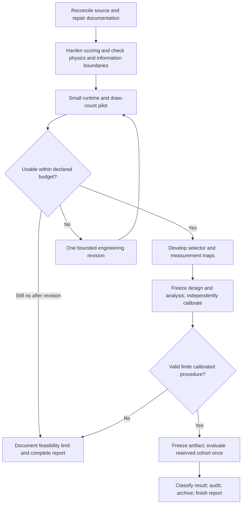
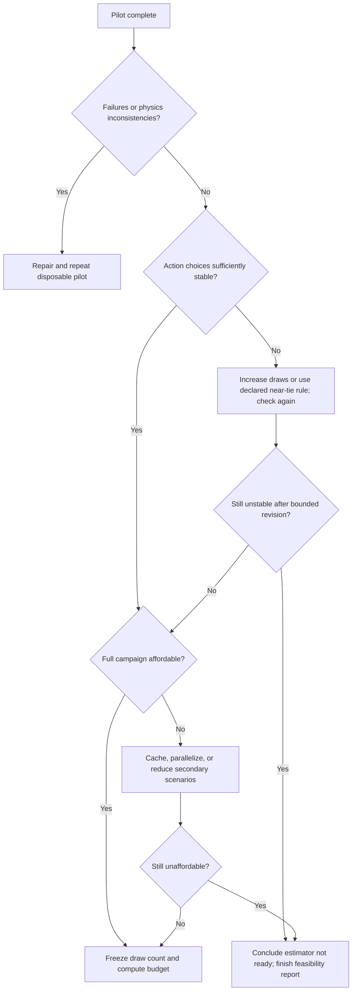
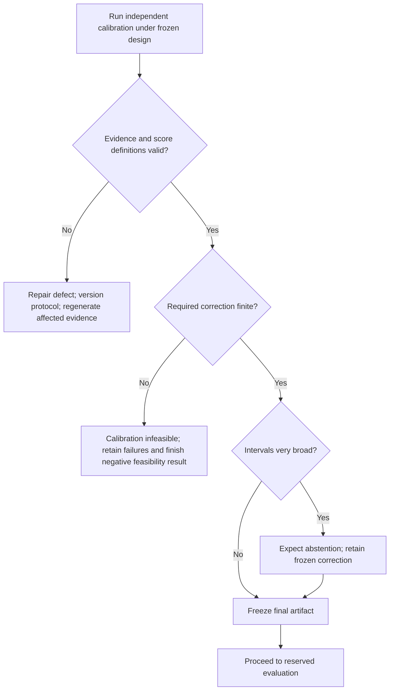
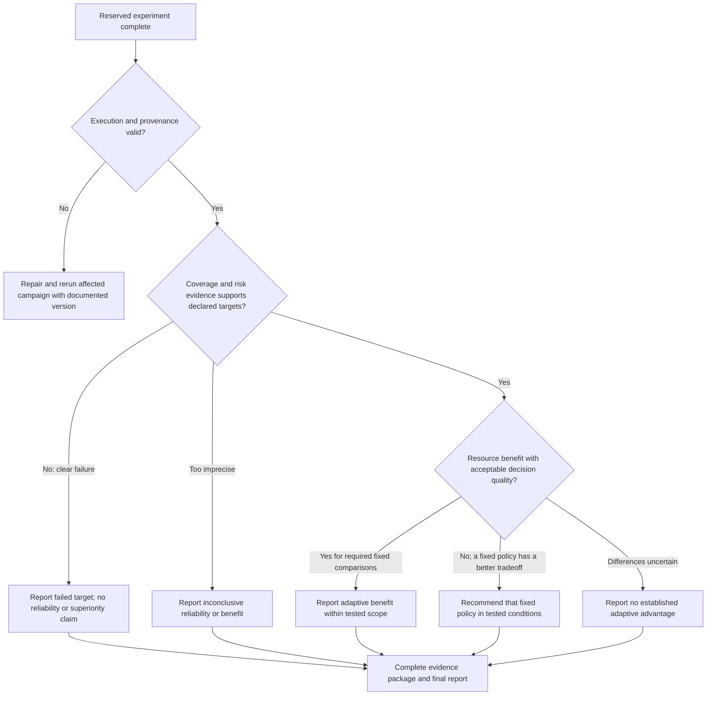

# Operating-decision experiment: instructions through project completion

Date: 2026-09-17. Status: proposed execution protocol, not a scientific freeze.

This plan completes the software-only operating-decision experiment and its final report, presentation, and reproducibility package. It does not require hardware validation or reopening unrelated ThermoTwin studies. New numerical choices below are recommendations to resolve and record before generating the relevant data; they are not previously agreed or demonstrated results.

## 1. Starting point and intended result

Use the audited prospective implementation at commit `9a21aa7` as the known starting point, checking for subsequent changes before implementation. Steps 1–3 exist: four-action selection, prospective uncertainty estimation, and resource costs. Measurement maps, prospective calibration, and the new reserved evaluation remain unfinished.

Preserve the corrected replication as a completed, narrower experiment. Its scalar guard did not meet its promotion criterion. The parent selector covered 80/100 fresh blocks across three cohorts; that is evidence of undercoverage by this frozen artifact. It does not prove an RNG defect remains or that pooled conformal calibration is intrinsically invalid. Small-calibration variability and heterogeneous action branches both matter. The 19/20 concentration of misses in Family C's voltage branch is a useful post hoc diagnosis, not a proven universal causal explanation.

The question to finish is:

> Can a procedure choose among stopping, more thermal testing, voltage sensing, and temporary face-temperature sensing, and improve the operating-decision/resource tradeoff relative to the strongest fixed alternatives under the declared synthetic conditions?

An adaptive win, a fixed-policy win, and an inconclusive comparison are all legitimate completed results. A material implementation defect is not a scientific result until its affected evidence is repaired and regenerated.

The loop above is limited to one planned scientific redesign. Ordinary repairs of demonstrable software defects remain necessary and must be versioned; do not describe them as favorable experimental results.

## 2. Phase A — Establish the authoritative starting state

1. Work in an isolated clean checkout based on the latest reviewed prospective source. Preserve unrelated local edits and the historical frozen source/manifests. Do not silently switch or merge the shared checkout.
2. Update the corrected-replication conclusions, README status, and original-outline status. Explicitly distinguish the completed correction campaign from the unfinished four-action experiment.
3. Explain the corrected replication's fixed-policy tradeoffs and nominal-versus-realized energy results as descriptive comparisons. State that changes from the original campaign include numerical-protocol changes as well as the RNG repair.
4. Correct old statistical-guarantee wording, exception semantics, runtime requirements, stale local paths, and claims that mutable releases are immutable. Preserve historical artifacts; add clear supersession notes rather than rewriting their results.
5. Create a new campaign identifier with disjoint pilot, development, calibration, and reserved namespaces. Record permitted uses and planned sizes before generating each partition.

**Deliverable:** a current status document, isolated source revision, and partition ledger.

| Result | Next action |
| --- | --- |
| Latest changes match the audited interfaces | Proceed to Phase B. |
| New numerical changes appeared after `9a21aa7` | Review their scientific effects and relevant checks before proceeding. |
| Historical archive or source digest does not match | Resolve provenance first; do not build claims on an unidentified implementation. |

## 3. Phase B — Finish the scientific interfaces before running a cohort

### Selection and uncertainty

Implement a versioned scoring layer that can use development-derived action offsets:

`B = W_initial + 2*d_stop`

`P_a = worst_source_mean(scored future width for action a, including 2*d_a)`

`value_a = (B - P_a) / cost_a`

Here `d_stop` and `d_a` are learned only from development evidence. They are frozen heuristics used to choose actions, not the final independent calibration. Keep the expensive raw predictive results reusable when changing costs or these offsets.

Preserve the existing numerical protections after adding offsets. A failed predictive draw receives the padded baseline `B`; a draw losing an initially admissible candidate receives at least `B`. Adding an action offset to a raw failure imputation must not accidentally turn failure or candidate loss into apparent information gain. Keep every draw in its denominator and retain negative gains.

Define the stop gate explicitly. Use the development-padded initial envelope and a frozen additional clearance; record whether one or two source candidates remain. A single admissible candidate is allowed, but development must separately examine that stop stratum. Do not restore the old rule that one excluded candidate invalidates an otherwise usable case. `stop_now` still requires verification.

Make the eligibility rule explicit as `(N, maximum unstable draws per source/action)`. Preserve the existing 4/4, 8/8, and 15/16 behavior as a documented pilot comparison if desired, but do not call these identical eligibility criteria.

### Physics and data-flow acceptance checks

Run the relevant existing tests and add focused tests for the changed boundaries. Verify:

- Heat-flow signs, energy balance, positive physical parameters, and limiting cases for thermal contacts and storage.
- Temporary probe loading during its actual acquisition/verification runs, and removal for the unloaded target forecast.
- Electrical terminal-energy accounting and its declared sign convention; distinguish nominal selection costs from realized diagnostic energy.
- Solver tolerance and time-grid convergence of the minimum operating margin, especially near current switches and zero-margin cases. Inspect continuous-trajectory extrema sufficiently to avoid missing an inter-sample temperature violation.
- Acquisition-only selection inputs; no truth-family label, actual future measurements, verification result, or final outcome enters selection. Hidden synthetic labels may inform development/calibration only through their declared offline roles.
- Verification cannot refit physical parameters or per-run offsets. Save the final decision before revealing/scoring the target response.
- Semantic random streams, authorized common draws, absence of accidental stream reuse, complete failure records, and source-bound artifacts.

These checks establish consistency of the declared numerical model. They do not establish that its synthetic truth families capture all real thermoelectric devices. Call the predictive draws an approximate local-covariance calculation; worst-case aggregation protects only across the surviving candidate models.

**Deliverable:** versioned interfaces, focused regression tests, and a short physics/numerics acceptance record. A physics or leakage defect must be fixed before Phase C. A passing test suite alone is not evidence of selector benefit.

## 4. Phase C — Run a small disposable pilot and set the compute budget

Start with **four blocks, each containing one device from each of the three truth families: 12 cases**. This is a proposed pilot size. Generate 16 predictive draws once and evaluate the matching 4-, 8-, and 16-draw prefixes. Generate all intended draws for this pilot even where an early stop would otherwise avoid scoring.

Record wall time and CPU time, optimizer/solver failures, candidate transitions, memory, archive size, action scores, selected actions, and eligibility counts. Show results for every case. An all-16-stable subset may isolate Monte Carlo variation, but cannot replace the full-cohort analysis.

Recommended engineering acceptance rule: choose the smallest tested `N` whose selected action agrees with `N=16` in at least 90% of all pilot cases and whose changed choices have at most 5% normalized utility regret relative to the `N=16` scores. Define normalization as the largest absolute finite reference action utility, with zero regret when all are zero. Include stop and explicit failure status in action agreement; report eligibility-driven changes separately. These are pilot heuristics, not validated accuracy bounds.

When `N=16` is needed, run a prefix-matched `N=32` check on a predesignated representative subset, including unstable and near-tie cases. Do not select only favorable cases for this check. If higher counts change decisions materially, the prospective estimator has not demonstrated sufficient numerical stability.

Estimate full-campaign duration using the measured distribution, including two-source cases, verification, all fixed policies, and artifact writing. Do not rely on the earlier 4–12-hour estimate. Cache acquisition fits; reuse physical draws and raw action results across cost-only scenarios; parallelize independent blocks within the measured memory limit. Preserve deterministic outputs across worker counts.

Reduce optional sensitivity work before compromising the primary comparison or silently choosing an unstable draw count. If the feasible sample size will leave important questions unresolved, retain the smaller study only with that limitation fixed in advance.

## 5. Phase D — Develop the full selector and the measurement map

Use a fresh development partition. A practical starting allocation is **30 blocks / 90 cases**, with 20 blocks for fitting/tuning and 10 for an internal check. This is development evidence throughout; it is not final validation. Generate counterfactual outcomes for all four packages for offline development, while enforcing the acquisition-only boundary inside each simulated policy.

1. Estimate nonnegative development offsets for the actions and the stop gate, then select clearance, value thresholds, and the final instability allowance from a small declared grid. Inspect Family C and one-candidate stopping explicitly.
2. Set a minimum development support count for a separately estimated offset; proposed default: 20 cases. If support is sparse, use a declared conservative shared development offset or disable early stopping in that stratum. Do not imply group-conditional coverage from sparse cells.
3. Keep the candidate menu fixed. Do not add Family C's true constitutive law to make its failures disappear.
4. Compare the development selector against stop, fixed thermal, fixed voltage, and fixed face temperature. Preserve failure, abstention, approval, and rejection counts.
5. Build the existing 12-cell cost map by reusing the authenticated predictions. Separately define actual sensor-quality/loading scenarios. A compact starting catalog is nominal sensing, higher voltage noise, higher face-temperature noise, and higher probe loading. Fix exact values from the declared synthetic ranges before producing the map. Changed quality/loading requires affected simulations and fits to be rerun; changing an instrumentation price does not simulate a worse sensor.
6. Distinguish selected action from eventual definitive decision. A cell that selects voltage can still end in abstention. Show failure and no-useful-measurement regions.

Recheck draw-count sensitivity on a predetermined development subset after adding the development offsets and final stop rule. The earlier raw-score pilot does not establish stability of every later padded ranking. Increase and freeze `N` here if needed, before independent calibration.

Use the balanced cost scenario and nominal sensing for the primary scientific comparison. Treat the other cost/quality maps as secondary development sensitivity analyses unless separately included in the frozen calibration/evaluation design. Reusing calibration across genuinely different sensor distributions is not justified automatically.

| Development result | Next action |
| --- | --- |
| Selector uses several actions with useful tradeoffs | Freeze the design after the internal check. |
| One action wins nearly everywhere | Accept that result; investigate ties/scaling once, then retain the fixed-policy interpretation if correct. Do not force action diversity. |
| Raw-width and development-padded rankings differ | Use the padded design; label earlier raw maps provisional. |
| Family C or early stopping shows systematic overconfidence | Adjust development offsets/clearance within the declared grid; check the remaining development evidence. |
| Most actions fail eligibility | Inspect numerical causes; make the one bounded revision if warranted. If unresolved, finish with a feasibility limitation. |
| No convincing development advantage, but procedure is stable and affordable | Continue to the reserved comparison to quantify the null result. Do not require a favorable pilot to finish. |

**Deliverable:** one selected design, all development results, measurement maps, and a record of tried variants. Recommend one planned redesign at most, with a newly allocated development check if the old check was used to revise the design.

## 6. Phase E — Freeze the analysis and independently calibrate

### Decide the claim before opening calibration or reserved outcomes

Retain the outline's proposed targets: at most 10% false approvals and at least 70% definitive decisions. Keep interval coverage distinct from decision coverage and false-approval risk: 90% interval coverage does not imply at most 10% errors conditional on approval.

Recommended primary question: **does the selector reduce realized diagnostic energy while retaining acceptable decision quality relative to the strongest eligible fixed alternative?** Report runs, elapsed-time assumptions, instruments, and computation separately. Energy savings alone do not establish overall time or financial savings.

Freeze an analysis specification containing:

- All four fixed comparators, identical underlying paired blocks, and the same fitting, verification, and calibration standard for each procedure.
- Proposed non-inferiority margins of **5 percentage points for decision coverage** and **2 percentage points for false-approval risk**, explicitly labeled project choices rather than scientific constants. The latter may require substantially more approvals than the proposed cohort supplies; check that before promising a conclusive comparison.
- One-sided confidence bounds for the 10% false-approval target and the 70% decision-coverage target, with a declared method that respects block dependence. Report per-family counts and bounds. Do not use a zero-width bootstrap interval as a risk bound when no errors occur.
- Paired block-level energy and coverage contrasts, with simultaneous/multiplicity-adjusted inference for claims against multiple fixed policies. Define the fixed-policy feasibility and comparison rules in advance; do not pick an easy comparator after seeing reserved results. Compare the full fixed-policy frontier as well as voltage and face individually. A cheap fixed policy with inadequate decision coverage and an expensive one with superior coverage represent different tradeoffs.
- An explicit success rule: required risk/coverage bounds pass, energy improves against the relevant fixed comparators, and both coverage loss and risk increase are within their declared margins. If only some named comparisons pass, narrow the claim accordingly. Do not call this superiority to the strongest fixed strategy when another fixed strategy offers a better qualifying tradeoff. If the risk comparison is underpowered, say so even when both policies observe zero errors.
- Exact denominators for false approvals, missed violations, false rejections, decisions, abstentions, failures, interval coverage, and simultaneous block coverage. Empty denominators are N/A.
- A frozen small decision-threshold grid for secondary risk/coverage curves. No selecting the headline threshold from reserved labels.

Plan **100 calibration blocks and 100 reserved blocks** as a starting compute/precision proposal, subject to Phase C. Each block contains three cases, one per family; 100 blocks are not 300 independent observations. Use development estimates to check the expected approval/violation counts, precision, and power of the chosen comparisons. Increase the planned reserved size if needed and affordable, before opening it. If unaffordable, record which conclusions will remain underpowered. Do not enlarge it reactively after seeing a near-significant result.

### Recommended calibration construction

Freeze the selector, development offsets, verification gates, scenarios, and every selection threshold before using independent calibration labels. Then calibrate the **complete frozen procedure**, including its selected action and verification outcome.

For each case with an emitted raw interval `[L,U]`, define the base interval `[L-d_a,U+d_a]`. Its score is `max(0, L-d_a-m_true, m_true-(U+d_a))`. For each calibration block take the maximum score across all three families. Retain numerical failures and missing intervals with infinite scores; never drop them or count a nonexistent interval as covered.

Choose one additional procedure-level correction `q` from those block scores. Final emitted intervals are `[L-d_a-q,U+d_a+q]`. This preserves the original simultaneous-within-block target. Development action offsets address heterogeneity without splitting final calibration into tiny action cells. The final `q` must not alter action selection, stopping clearance, or fitted parameters. Give each fixed policy the same calibration standard, with its own correction.

I recommend targeting **at least 90% block coverage with at least 95% confidence over independent calibration samples**, rather than relying only on ordinary marginal split-conformal coverage. Under the declared independent, identically distributed block generator, select order-statistic rank `k` satisfying:

`P[Binomial(n, 0.90) <= k-1] >= 0.95`.

For `n=100`, use the **96th smallest block score**; the associated confidence is about 97.63% because the rank is discrete. Ordinary 90% split conformal would use rank 91 and answers a different question. This recommendation follows the tolerance-region interpretation of calibration-conditional coverage; it is an additional conservative design choice, not a guarantee the current project already has. These confidence statements are per procedure, not automatically joint across every policy/scenario. See [Hulsman, Distribution-Free Finite-Sample Guarantees and Split Conformal Prediction](https://arxiv.org/abs/2210.14735).

If group-conditional coverage is also desired, it requires a separate design, adequate selected-action counts, and a valid allocation for the simultaneous target. Simply giving each action a nominal 90% interval is insufficient. The broader distinction between marginal and conditional guarantees is explained by [Angelopoulos and Bates](https://arxiv.org/abs/2107.07511).

Before generating calibration, verify the score-to-coverage correspondence and order-statistic implementation with controlled examples, including failed cases. Bind that design in the protocol.

Do not tune the selector on calibration outcomes to recover decision coverage. Broad but valid intervals are a result the reserved experiment should measure. A statistically inadequate design discovered here requires a new version and fresh calibration; the old calibration cannot become an invisible tuning set.

## 7. Phase F — Execute the reserved experiment once

Before generating reserved observations, commit and hash the source manifest, environment, generator, partition identities, chosen `N`, eligibility rule, offsets, final corrections, stop gate, verification gates, cost/scenario catalog, sample size, endpoints, comparison rules, and failure policy. Confirm exact replay in a disposable end-to-end rehearsal.

For each paired block, execute all fixed policies and the selector under the same underlying device conditions and explicitly declared shared observations. Preserve the information boundary inside each procedure. Save decisions before target scoring. Capture every raw observation, fit status, candidate exclusion, predictive draw, selected action, verification result, final interval, failure, resource count, and timing.

Evaluate the primary scenario once. Secondary predeclared curves may reuse its stored outputs only where mathematically valid; altered measurement quality needs corresponding data and, for calibrated decision claims, appropriate calibration. Do not quietly extend the frozen primary claim to every map cell.

| Event | Required response |
| --- | --- |
| Ordinary fit failure, excluded candidate, failed verification, or abstention | Apply the frozen rule; retain the case and its denominator. |
| Process interruption with intact deterministic checkpoint | Resume missing work under the identical artifact; do not regenerate successful cases with new seeds. |
| Unexpected truth-solver failure, leakage, wrong source, or material implementation bug | Stop scientific interpretation. Record the incident and version a full rerun of the affected campaign; never delete only inconvenient rows. If exposed outcomes inform changes, use a new reserved partition. |
| Low coverage, sparse approvals, or no statistical improvement with otherwise valid execution | Keep the result. Do not tune, reseed, or extend evaluation reactively. |

## 8. Phase G — Decide what the experiment establishes

Interpret common outcomes carefully:

- **High interval coverage, excessive abstention:** uncertainty is conservative but the system has not met the usefulness target. Report it without narrowing intervals after evaluation.
- **Low coverage concentrated in Family C:** the frozen procedure is insufficient for the declared mismatch family. Calibration is not evidence of robustness to arbitrary unseen physics.
- **Zero decision errors but few approvals:** report counts and nonzero upper risk bounds; reliability may remain unresolved.
- **Savings only under cheap face sensing or other secondary assumptions:** report a conditional sensitivity result, not a universal adaptive win.
- **Nearly identical policies:** report the uncertainty of the difference. Extra selector computation is a real cost and may favor the simpler fixed policy.
- **Successful comparison:** make claims only for the frozen generator, operating regime, instruments, and cost assumptions. This remains synthetic evidence.

## 9. Phase H — Close the project with auditable deliverables

Produce the three original figures:

1. **Decision story:** plausible initial fits, divergent internal forecasts, the selected measurement, and the untouched operating trajectory revealed after the saved decision. Select the example by a frozen rule or label it illustrative.
2. **Comparison:** decision errors, decision/interval/block coverage, and uncertainty alongside energy, runs, elapsed-time assumptions, instrument burden, and computation for every policy.
3. **Measurement map:** cost and actual sensor-quality/loading effects, with explicit abstention/failure regions and a clear distinction between development sensitivity and reserved evidence.

Write the final report with methods, original-outline traceability, all primary and secondary results, limitations, failure analysis, and the selected final conclusion. Include trajectory/parameter errors as supporting diagnostics; do not require identifying a correct candidate family when Family C is intentionally absent from the menu.

Recompute all summary metrics independently from the saved case records. Check paired comparisons and confidence calculations independently; replay a predetermined sample spanning families, actions, failures, and near-boundary cases. Run the complete relevant suite in the recorded scientific environment. Tests certify the implementation checks, not all real-world physics.

Archive raw diagnostics, machine-readable outcomes, protocol/calibration artifacts, source/environment manifests, reproduction instructions, and figure-generation inputs. Verify archive round trips and hashes. Prefer an archival deposit or immutable release when available; otherwise describe the archive accurately as hash-verified, not immutable. Update the project roadmap and prepare a concise presentation explaining the engineering question, result, and practical limits.

The project is complete when another person can reconstruct the reported decisions and comparisons, the original four-action question has an honest outcome or documented feasibility limit, and the report states which approach to use under the tested assumptions. Hardware experiments, new candidate physics, PINN extensions, or a new operating regime are separate follow-on projects with new protocols.

## Immediate implementation assignment

Execute Phases A and B first, then the small disposable pilot in Phase C. Return the source revision, checks, complete pilot results, recommended draw count, measured campaign budget, and the proposed development/calibration/reserved sizes. Proceed through the remaining phases under the decision rules above; settle and record all numerical defaults before opening the data they govern. Do not launch the large scientific campaign using unresolved calibration, eligibility, or comparison rules.

## Source record

- [Original operating-decision outline](OPERATING_DECISION_EXPERIMENT_OUTLINE.md).
- [September 17 audit of the corrected replication and Step 1](THERMOTWIN_AUDIT_2026_09_17.md).
- [September 17 audit of Steps 2 and 3](THERMOTWIN_AUDIT_2026_09_17_STEPS_2_3.md).
- “ThermoTwin Development 03,” September 17 discussion, and the prospective-selector specification at audited commit `9a21aa7`.

This plan synthesizes those records and corrects the overstrong inference that the observed coverage shortfall proves pooled calibration itself invalid. It introduces no new scientific outcome and does not constitute a fresh audit of every ThermoTwin subsystem.
