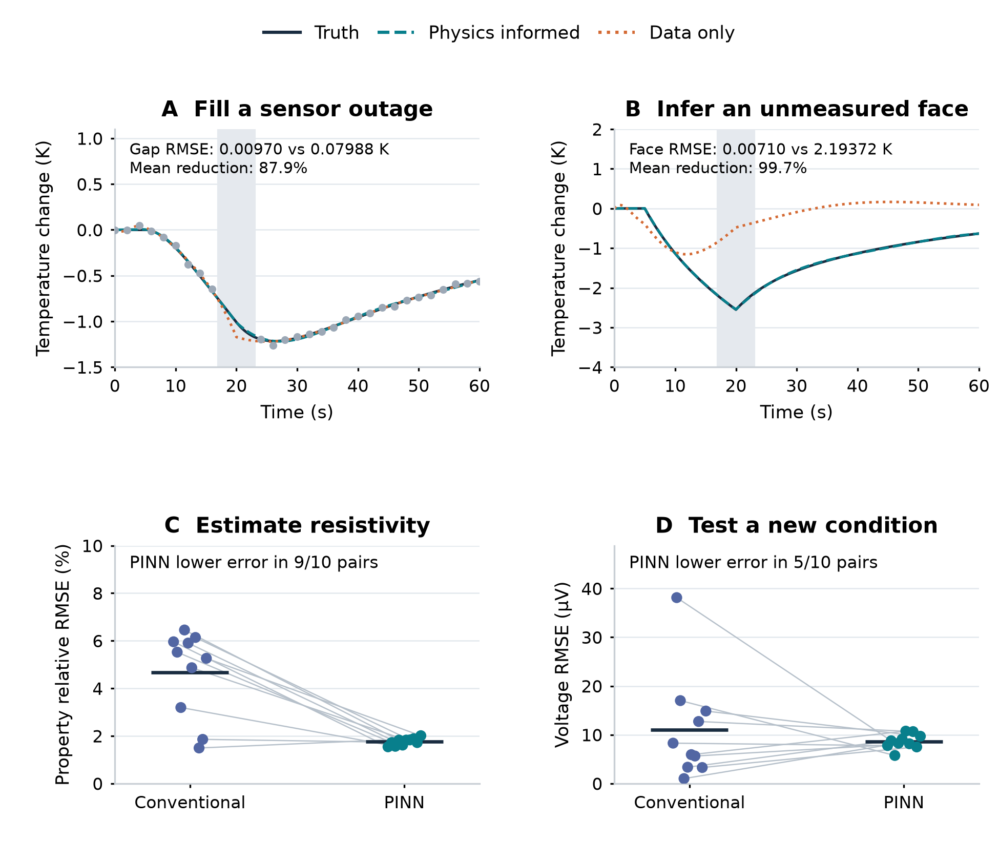

# Physics-Informed Reconstruction and Material-Property Inference in ThermoTwin

## Abstract

Hardware experiments often provide incomplete measurements of systems whose internal states and material properties determine performance. This report evaluates two uses of physics-informed neural networks (PINNs) in ThermoTwin, a synthetic thermoelectric modeling platform. First, identically initialized networks reconstruct a four-temperature device trajectory from the same noisy, incomplete measurements. One network also receives the governing energy balances. Across five paired trials, adding physics reduces mean temperature error during a sensor outage from 0.07988 K to 0.00970 K and error at unmeasured module faces from 2.19372 K to 0.00710 K. Second, an inverse PINN and a conventional numerical-model estimator infer temperature-dependent electrical resistivity from the same noisy face temperatures and voltage. Synthetic truth comes from a separate numerical implementation and a material curve outside the fitted representation. Across ten paired trials, mean resistivity error is 1.7537% for the PINN and 4.6639% for the conventional estimator; the PINN performs better in nine trials. Predictions under a withheld operating condition are more evenly matched. A separate training audit shows why low material-property error alone does not establish adequate physics satisfaction or curve-shape recovery. Together, the studies demonstrate an evaluation workflow for hardware modeling. They do not establish hardware accuracy or general superiority over conventional solvers.

## Introduction

Computational models can reduce hardware iteration when they extract more useful information from each experiment. Two recurring difficulties are missing measurements and uncertain material properties. Sensors may fail during a transient, while temperatures inside an assembly may be inaccessible. Even with external measurements, several material descriptions may explain the observations approximately equally well.

ThermoTwin was developed as a small, inspectable environment for studying these problems. Thermoelectric systems provide coupled electrical and thermal behavior, transient heat storage, interfaces, and temperature-dependent transport properties. These features support controlled tests of how physical knowledge and measurements can be combined, without representing the full complexity of an industrial system.

This report combines two complementary studies. The first isolates what energy-balance constraints contribute to neural reconstruction when physical parameters are known. The second compares an inverse PINN with an implemented conventional estimator under numerical and material-representation mismatch. The intended engineering question is when a newer modeling method supplies useful evidence and what checks are required before using it to guide another experiment or design iteration.

All observations are synthetic. ThermoTwin was developed with assistance from AI coding tools. Conclusions here are tied to saved configurations, numerical outputs, and explicit evaluation procedures; the software has not been validated against hardware measurements.

## Background

A conventional forward solver calculates behavior from specified physical parameters. An inverse estimator repeatedly changes unknown parameters, runs that solver, and compares predictions with observations. A PINN instead represents an unknown state with a neural network and penalizes violations of the governing equations. An inverse PINN trains selected physical parameters alongside that state representation. These uses correspond to the solution and discovery settings described by Raissi and colleagues [1, 2]. Training can nevertheless fail to satisfy the intended equations adequately, so physical residuals and optimizer behavior require direct evaluation [3].

The reconstruction model represents the cold and hot module faces and their adjoining heat exchangers as four temperatures. Heat moves through the module, thermal contacts, and reservoir connections. Thermoelectric pumping and electrical heating couple the electrical input to the thermal balances.

The material-inference model resolves temperature along a one-dimensional thermoelectric leg. With position x, current density J, temperature T, electric field E, and heat flux q, its constitutive relations and conservation equation are:

$$E=\rho_e(T)J+\alpha(T)\frac{\partial T}{\partial x},\qquad q=\alpha(T)TJ-\kappa(T)\frac{\partial T}{\partial x}$$

$$\rho_m c_p\frac{\partial T}{\partial t}=-\frac{\partial q}{\partial x}+JE$$

Electrical resistivity, the Seebeck coefficient, thermal conductivity, and volumetric heat capacity determine these terms. Additional face balances connect the leg to reservoirs. This is coupled electrical and thermal physics; structural mechanics and other physical domains are not included.

Comparing matched networks with and without physics isolates the contribution of the equations. It does not compare against every conventional state estimator. Likewise, lower error in an inferred property does not necessarily produce better predictions for every subsequent operating condition.

## Methods

### Matched reconstruction from incomplete temperatures

The first study uses a 60-second four-node experiment with a 1 A pulse from 5 to 20 seconds. All four temperatures and both reservoirs initially equal 300 K. The reference trajectory uses fourth-order Runge–Kutta integration with a 0.1-second step. Physical parameters remain fixed and known during reconstruction. The Seebeck coefficient is 0.05 V/K, electrical resistance is 2 ohms, and thermal conductance is 0.5 W/K. Cold-face, hot-face, cold-exchanger, and hot-exchanger capacitances are 50, 100, 50, and 100 J/K. Both contact resistances are 0.25 K/W; reservoir conductances are 2 and 4 W/K. [P1]

Only the two heat-exchanger temperatures are observed, at two-second intervals. Independent Gaussian noise has a standard deviation of 0.02 K. Both sensors are unavailable from 17 to 23 seconds, removing six of the original 62 readings and leaving 56. Neither module face supplies temperature labels after the known initial state.

Each model contains three subnetworks, one per constant-current interval. Each subnetwork has two hidden layers of 16 tanh units and outputs four temperatures. Both models therefore have 1,116 trainable parameters. Their construction enforces the initial temperatures and continuity at current changes.

Within each of five trials, a common template is copied to create the two models; saved checks confirm exactly equal initial weights. Both receive identical observations and 5,000 Adam updates at learning rate 0.001. Observation and neural seeds are separate and vary between trials; the evaluation seed blocks start at 72001. Device parameters remain fixed.

The data-only objective is mean squared observation error normalized by 0.10 K. The PINN adds 100 times mean squared energy-balance residual normalized by 0.10 K/s, evaluated at 72 collocation points across the current intervals:

$$L_{\mathrm{PINN}}=\operatorname{mean}\!\left[\left(\frac{\hat T-y}{0.10\ \mathrm K}\right)^2\right]+100\operatorname{mean}\!\left[\left(\frac{r_T}{0.10\ \mathrm{K/s}}\right)^2\right]$$

The observation normalization is a training scale, distinct from sensor uncertainty. The physics weight of 100 was selected using a separate development seed, 70001, before evaluation on the five reported seed blocks. Equal update counts do not imply equal computational work, because physics training also differentiates the temperature predictions.

Temperature errors are calculated against the noise-free reference. Missing-interval error pools both exchanger channels between 17 and 23 seconds; hidden-face error pools both module faces over the full trajectory. Summaries are arithmetic means of the five trial RMSEs. Node residuals are evaluated on a denser grid than training. A separate calculation checks total stored-energy change against electrical and external heat input. This diagnostic follows algebraically from the same balances; it is an additional implementation check, not an independent physical law. Recorded CPU training times cover the optimization loop.

### Distributed resistivity inference

The second study uses a synthetic thermoelectric leg 1.5 mm long with cross-sectional area 2.25 mm². Each face has thermal capacitance 0.05 J/K and reservoir conductance 0.01 W/K. Geometry, face parameters, initial conditions, and all material properties other than electrical resistivity are known. Density is 7,700 kg/m³ and specific heat is 150 J/(kg K). At 285, 300, and 315 K, the known Seebeck values are 195, 200, and 205 µV/K; thermal conductivity values are 1.45, 1.50, and 1.56 W/(m K), with linear interpolation. [P3, P4]

The fitted resistivity has values at 285, 300, and 315 K, with linear interpolation. Each value equals a known baseline multiplied by the exponential of a fitted log coefficient. Baseline values are 1.05, 1.00, and 0.96 times 10⁻⁵ Ω·m. Synthetic truth instead uses a smooth cubic:

$$\rho_{\mathrm{true}}(T)=10^{-5}\left(1.07-0.0816z-0.0296z^2+0.03z^3\right)\ \Omega\,\mathrm m,\qquad z=\frac{T-300}{15}$$

Its multipliers at the inference knots are 1.04, 1.07, and 1.03, but the cubic cannot generally be represented by the fitted straight-line segments.

Truth trajectories use 25 nodal temperatures, separately assembled fluxes and voltage quadrature, and third-order strong-stability-preserving Runge–Kutta integration with a 0.00025-second step. The conventional inference solver uses five cell-centered finite volumes and fourth-order Runge–Kutta integration with a 0.0015-second step. This introduces numerical and representation mismatch while retaining the same continuum physics.

Three 0.4-second experiments provide fitting data: zero-current relaxation toward 290/310 K reservoirs, and +0.8 A and −0.8 A experiments initially spanning 295–305 K. Cold-face temperature, hot-face temperature, and voltage are sampled every 0.08 seconds, with noise standard deviations of 0.01 K and 10 µV. Twenty noise trials are available for conventional estimators. The first ten also have PINNs and form the paired comparison here. The true material remains fixed; each trial has a separate neural seed and three observation-noise seeds shared across compared methods.

The conventional estimate is selected from initial multiplier curves (0.8, 1.0, 1.2), (1.0, 1.0, 1.0), and (1.2, 1.0, 0.8), using the full penalized objective. Each start receives one coordinate pass, six golden-section iterations per coordinate, and four Gauss–Newton iterations. Log multipliers are bounded to −0.3 through 0.3.

The inverse PINN trains three temperature networks with a shared resistivity curve; all three property multipliers start at 0.9. Each network has three hidden layers of 20 tanh units. Training uses 400 Adam updates, network and property learning rates of 0.002, seven interior spatial points, 18 time points, and 16 spatial points for voltage quadrature. Initial conditions are enforced by construction. The objective combines noise-normalized observation error with interior and face-balance residuals normalized by 1 K/s. Observation and physics weights are both 1 in this campaign.

Both regularized estimators receive the same explicit penalties: 0.8 times squared second-difference roughness in log multipliers and 0.9 times their mean squared magnitude. The PINN additionally retains implicit effects from its representation and finite training duration. Its log multipliers are not explicitly bounded, although all saved estimates lie inside the conventional bounds.

Property error is relative RMSE at 61 equally spaced temperatures from 285 to 315 K. This is the declared evaluation interval, not the range fully excited by fitting. A fresh truth-only simulation during report preparation established a training temperature range of approximately 294.83–305.21 K. This numerical audit did not retrain or alter any estimator.

After fitting, each curve is frozen and inserted into the same conventional forward solver for an excluded +0.4 A experiment initially spanning 290–310 K. Voltage and hidden-temperature predictions are compared with independent numerical truth. This evaluates transfer of the inferred property, not direct forward prediction by the trained neural fields.

### Supporting training-adequacy audit

A separate three-trial study evaluates uninterrupted training trajectories at 600, 1,200, and 2,400 epochs. It uses matching finite-volume truth and a three-knot property representation, four fitting regimes, and physics weight 10. It addresses training adequacy under different conditions from the independent-truth comparison. [P5]

An operational checkpoint must have normalized observation loss no greater than 2 and physics-residual RMS no greater than 25% of a nominal reference temperature-rate RMS. Separate truth-known diagnostics test recovered curve amplitude and center curvature. Physics weights 1, 3, and 10 were compared on trial 0 using only observation and physics criteria; weight 10 was then frozen before trials 1 and 2. Trial 0 therefore contributes to both development and the reported three-trial summary. These results are supporting diagnostics, not three fully independent evaluation trials.

## Results

### Physics improves missing and hidden temperatures

Adding energy balances reduced mean missing-interval RMSE by 87.86% and hidden-face RMSE by 99.676%. Missing-temperature error, hidden-temperature error, and energy closure all improved in each of the five paired trials. Figure 1 combines this reconstruction evidence with the separate inverse comparison. [P1, P2]

| Mean across five paired trials | Data-only | Physics-informed |
|---|---:|---:|
| Missing exchanger temperatures, RMSE | 0.07988 K | 0.00970 K |
| Unmeasured module faces, RMSE | 2.19372 K | 0.00710 K |
| All four temperatures, RMSE | 1.55135 K | 0.00720 K |
| Retained noisy observations, RMSE | 0.01747 K | 0.01943 K |
| Energy-rate closure RMS | 16.49359 W | 0.13283 W |
| CPU training time | 3.949 s | 15.057 s |

Figure 1. Two complementary evaluations of physics-informed learning. Upper panels show representative cold-side trajectories from the first of five matched reconstruction trials; error annotations average both corresponding channels across all five trials. Both networks receive identical readings, architecture, initial weights, and initial temperatures. Lower panels compare ten shared noise trials. Connected points identify paired estimates, and horizontal marks show means. Property RMSE covers 285–315 K, while fitting temperatures span approximately 294.83–305.21 K. Withheld predictions use frozen inferred curves in the same conventional forward solver. The rows use different physical models and experimental designs; all results are synthetic.

The data-only model fitted retained noisy readings slightly more closely while predicting missing and hidden temperatures substantially worse. All five PINN trials passed the study's combined temperature and physics regression checks. Those maintained engineering thresholds do not imply exact energy conservation or preregistered statistical acceptance. Physics-informed training took approximately 3.8 times longer.

### Property recovery and transfer answer different questions

Across the ten shared trials, the inverse PINN had lower property error in nine and reduced mean property RMSE by 62.40% relative to the regularized conventional estimator. [P2, P3]

| Mean across ten paired trials | Conventional | Inverse PINN |
|---|---:|---:|
| Resistivity relative RMSE, 285–315 K | 4.6639% | 1.7537% |
| Withheld voltage RMSE | 11.0188 µV | 8.6405 µV |
| Withheld internal-temperature RMSE | 0.000764 K | 0.000684 K |

The PINN-derived curve produced lower withheld voltage error in only five of ten trials. Its lower mean voltage error is therefore not a consistent per-trial advantage. The conventional estimator also achieved lower mean noise-normalized observation loss, 0.8609 versus 1.2464, despite higher mean property error. These are paired ten-trial means; substituting conventional twenty-trial averages would change the comparison's data composition.

### Training adequacy remains a separate requirement

The supporting audit found that short runs could fit observations while leaving appreciable physics error and incomplete curve shape. [P5]

| Training epochs | Mean physics residual / reference rate | Operational checks passed | Shape checks passed |
|---:|---:|---:|---:|
| 600 | 50.68% | 0/3 | 0/3 |
| 1,200 | 33.19% | 0/3 | 2/3 |
| 2,400 | 21.17% | 3/3 | 2/3 |

Longer training improved physics satisfaction and average shape recovery, but one trial still failed the shape criteria at 2,400 epochs. These different-condition results do not certify convergence of the separate 400-epoch inverse comparison.

## Discussion

The reconstruction result shows how physical relationships connect accessible measurements to inaccessible states. Matched architecture, initialization, readings, and update count isolate the added balances. Observation fit alone is insufficient: a model can follow noisy labels yet perform poorly where labels are absent.

The large hidden-face improvement requires context. The data-only network has no post-initial hidden-face labels, no hidden-state regularizer, and no prior learned from other devices. Physical parameters and the initial state are known. The experiment demonstrates the information supplied by the equations, rather than superiority over conventional smoothing, state estimation, or direct numerical simulation.

The inverse study makes a harder comparison by changing the data-generation implementation and material representation and using multiple conventional starting guesses. Nevertheless, the methods differ in optimization budget, constraints, state representation, and implicit regularization. Their comparison supports a result for these implementations and settings; it does not isolate one mechanism responsible for the lower PINN property error.

Temperature coverage is consequential. Much of the 285–315 K evaluation interval lies outside fitting temperatures. Accuracy there depends partly on the supplied material representation and prior structure. Low aggregate error does not establish unique identification of the detailed curve throughout that interval. The holdout expands temperature coverage but remains synthetic.

The training audit reinforces this distinction. A material curve can be close to truth before the neural field adequately satisfies the equations or reproduces the smaller variations in curve shape. Observation loss, physical residual, property accuracy, and transfer performance should remain separate acceptance checks. The additional audit also illustrates transparent development accounting: its physics weight was selected on one trial, which must not be presented as untouched validation evidence.

For a hardware-development team, the reusable contribution is an evaluation workflow: define the missing information, connect it to measurements using physical knowledge, compare against a credible existing method, test a new operating condition, and state the evidence limits. Next steps include measured data, uncertain boundary conditions, sensor response and bias, alternative conventional state estimators, expanded temperature excitation, and convergence studies for both inverse methods.

Neither study establishes reduced total engineering time. Physics-informed reconstruction trained more slowly, and the inverse comparison lacks a controlled runtime benchmark. Any practical benefit from information recovery must justify computational and implementation costs for the particular application.

## Conclusion

ThermoTwin demonstrates two useful applications of physics-informed learning under explicit synthetic conditions. Adding energy balances substantially improves reconstruction of missing and unmeasured temperatures in a matched-network comparison. An inverse PINN also produces lower resistivity error than the implemented regularized conventional estimator in nine of ten paired trials with independent numerical truth. Its withheld-condition advantage is less consistent.

The evidence supports further evaluation of PINNs as components of a hardware-modeling workflow. Trustworthy use requires separate checks of measurement fit, physics satisfaction, parameter recovery, transfer, and cost. Hardware validation and broader estimator comparisons remain necessary before deployment or general superiority claims.

## Reproducibility

All five reconstruction trials and the ten shared inverse trials were included. Means, percentage reductions, and paired win counts were recalculated from saved outputs. Material errors were independently reconstructed from the inferred curves and cubic truth. A short truth-only simulation checked the temperature ranges; neural training was not repeated. The report bundle records SHA-256 hashes of the numerical sources in source_manifest.json. Figure 1 is redrawn for print from the same evidence as pinn_evidence_summary.png; the original figure remains available with the study.

## References and saved evidence

[1] Raissi, M., Perdikaris, P., and Karniadakis, G. E. (2017). Physics Informed Deep Learning (Part I): Data-driven Solutions of Nonlinear Partial Differential Equations. https://arxiv.org/abs/1711.10561

[2] Raissi, M., Perdikaris, P., and Karniadakis, G. E. (2017). Physics Informed Deep Learning (Part II): Data-driven Discovery of Nonlinear Partial Differential Equations. https://arxiv.org/abs/1711.10566

[3] Krishnapriyan, A. et al. (2021). Characterizing possible failure modes in physics-informed neural networks. Advances in Neural Information Processing Systems. https://proceedings.neurips.cc/paper/2021/hash/df438e5206f31600e6ae4af72f2725f1-Abstract.html

[P1] ThermoTwin matched reconstruction study. Saved data: thermotwin/figures/FORWARD_RECONSTRUCTION_COMPARISON/forward_reconstruction_comparison.json. Methods: thermotwin/studies/forward_reconstruction_comparison.py and thermotwin/FORWARD_RECONSTRUCTION_COMPARISON.md. Architecture: thermotwin/pinn/forward_piecewise.py. All five trials are included.

[P2] ThermoTwin combined PINN figure. thermotwin/figures/PINN_EVIDENCE_SUMMARY/pinn_evidence_summary.png and its JSON sidecar; thermotwin/reports/pinn_evidence_summary.py. The sidecar includes source hashes and records the two different study designs.

[P3] ThermoTwin distributed profile-coverage campaign. thermotwin/figures/DISTRIBUTED_PROFILE_COVERAGE/distributed_profile_coverage.json; thermotwin/studies/distributed_profile_coverage.py; thermotwin/inference/distributed_properties.py. This report selects the first ten trials with both regularized estimators.

[P4] ThermoTwin governing equations and numerical implementations. thermotwin/physics/distributed.py; thermotwin/simulation/distributed.py; thermotwin/simulation/distributed_independent.py; thermotwin/pinn/distributed_inverse.py. The report-preparation temperature-range audit reran only the specified truth simulations and did not alter fitted results.

[P5] ThermoTwin supporting training audit. thermotwin/figures/DISTRIBUTED_PINN_TRAINING_AUDIT/distributed_pinn_training_audit.json and thermotwin/DISTRIBUTED_PINN_TRAINING_AUDIT.md. The three-trial summary includes the trial used to select physics weight 10.
