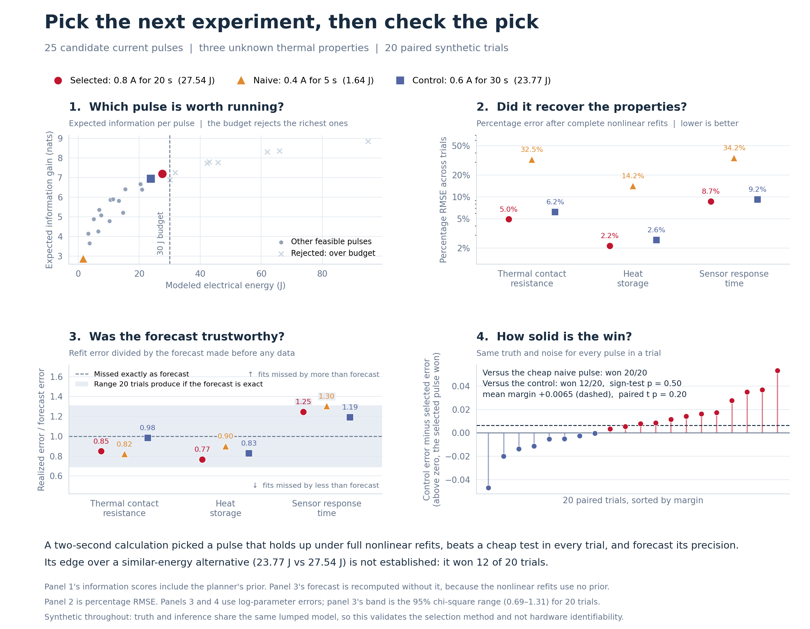

# Choosing Informative Thermoelectric Experiments Under an Energy Constraint

ThermoTwin research report | 27 September 2026

## Abstract

Hardware experiments are valuable when they distinguish uncertain device properties, rather than merely produce a measurable response. This study evaluates a computational workflow for choosing electrical pulse experiments on a simulated thermoelectric module. A four-node thermal model represents the module faces and their heat exchangers; only exchanger temperatures are measured. The unknown quantities are cold-side contact resistance, cold-face thermal capacitance and a shared sensor response time, with separate sensor offsets treated as nuisance parameters. A local Bayesian information criterion ranks 25 pulses under energy and temperature constraints. The selected 0.8 A, 20 s pulse consumes 27.54 J within a 30 J limit. An initial 250-trial linearized calculation predicts substantially better recovery than the lowest-energy pulse. Complete nonlinear fits across 20 paired synthetic trials confirm lower combined parameter error in every trial and parameter-specific percentage errors smaller by factors of 6.55, 6.60, and 3.92 (a 3.9–6.6-fold range). Comparison with a 23.77 J alternative is less decisive: the selected pulse wins 12 of 20 trials. These results support inexpensive candidate screening followed by explicit validation, while showing why recommendations need credible resource controls.

## Introduction

Early hardware development often requires estimating properties that cannot be measured directly in an assembled device. Thermal contacts, heat storage and sensor dynamics can produce overlapping effects in temperature histories. Choosing an input simply because it produces a large response may fail to distinguish these effects. Collecting more measurements of an uninformative response may likewise add little useful evidence.

This project asks whether a computational model can help decide which experiment to run next. The engineering workflow is to define uncertain quantities, describe practical constraints, rank feasible experiments and check whether the recommendation actually improves inference. Thermoelectric modules provide a compact setting in which electrical input, heat flow, thermal storage and sensor behavior interact.

Two related studies are combined. The first screens a finite set of pulses with local sensitivities and checks the resulting estimator under repeated noise. The second performs complete nonlinear fitting with varying device properties, offsets and noise. Keeping these stages separate distinguishes a planning calculation from a stronger evaluation of its consequences. All observations are synthetic. The work evaluates a computational workflow under controlled assumptions; it does not demonstrate improvements in a physical test campaign.

## Background

Bayesian experimental design treats the choice of an experiment as a decision problem: select the design that maximizes its expected utility. This allows prior knowledge and the purpose of the experiment to influence the choice. Chaloner and Verdinelli review this framework for linear and nonlinear models [1]. Here the utility is a local approximation to reduction in joint parameter uncertainty, subject to engineering constraints.

In this application, uncertain parameters can partially compensate for one another during fitting. Reproducing measured temperatures therefore does not establish accurate parameter recovery. A sensitivity matrix describes how predicted measurements change when each parameter changes. Together with an assumed noise level, it provides an approximate covariance. The D-optimal score summarizes joint uncertainty through its determinant, retaining parameter correlations. Sensitivities are evaluated at one nominal device, so the calculation is local; the subsequent nonlinear study tests how useful that approximation is away from the nominal point [S2, S4].

## Methods

### Physical system and measurements

The model contains four dynamic temperatures: the cold and hot thermoelectric faces and the corresponding heat exchangers. The face heat rates include Peltier heat pumping, Joule heating and passive heat leakage. Using cold and hot face temperatures in the following equations, the heat removed from the cold face and delivered to the hot face are [S1]:

$$Q_c=\alpha I T_c-\frac{1}{2}I^2R_e-K(T_h-T_c)$$

$$Q_h=\alpha I T_h+\frac{1}{2}I^2R_e-K(T_h-T_c)$$

Each temperature changes according to net heat flow divided by that node's thermal capacitance. Cold-contact heat is exchanger-minus-face temperature divided by cold-contact resistance. Hot-contact heat is hot-face-minus-exchanger temperature divided by hot-contact resistance. The cold face receives cold-contact heat and loses the heat pumped from it; the hot face receives the delivered heat and loses hot-contact heat. Each exchanger also exchanges heat with a fixed-temperature reservoir through a thermal conductance [S1].

All four initial temperatures and both reservoirs are 300 K, with no external heat load. Fixed thermoelectric properties are Seebeck coefficient 0.05 V/K, electrical resistance 2 ohms and thermal conductance 0.5 W/K. Nominal face capacitances are 50 and 100 J/K; exchanger capacitances are 50 and 100 J/K. Both nominal contact resistances are 0.25 K/W, and cold/hot reservoir conductances are 2/4 W/K. The estimated physical quantities are cold-contact resistance, cold-face capacitance and shared sensor response time, nominally 0.25 K/W, 50 J/K and 1.5 s. Other properties remain fixed [S1–S3].

Only the exchanger temperatures are observed. For each sensor, its filtered temperature follows a first-order response; a constant offset and independent Gaussian measurement error are then added:

$$\tau\dot S=T_x-S,\qquad y=S+b+\epsilon,\qquad\epsilon\sim N(0,0.02^2\ \mathrm{K}^2)$$

The four-node trajectory is integrated with fourth-order Runge–Kutta at 0.2 s resolution over 80 s. Sensor lag is integrated exactly for the piecewise-linear temperature history between these samples, starting at the initial exchanger temperature. Measurements are retained every second, including both endpoints: 162 observations per experiment [S1].

### Candidate selection

Each candidate is one pulse beginning at 5 s. Currents of 0.4, 0.6, 0.8, 1.0 and 1.2 A are combined with durations of 5, 10, 15, 20 and 30 s. All 25 candidates have the same observation window and measurement count. Physical parameters are represented by logarithms relative to their nominal values; the two sensor offsets complete a five-parameter vector. Central differences with log perturbations of plus or minus 0.01 calculate physical sensitivities, while offset sensitivities are analytic [S2].

For sensitivity matrix J, noise standard deviation sigma, and prior covariance P, the approximate posterior covariance and information score are:

$$\Sigma_{\mathrm{post}}=(J^\top J/\sigma^2+P^{-1})^{-1}$$

$$U=\frac{1}{2}\log\left(\frac{\det P_{\mathrm{physical}}}{\det\Sigma_{\mathrm{post,physical}}}\right)$$

Prior standard deviations are 0.20, 0.50 and 0.30 in the three log-parameter coordinates and 0.10 K for each sensor offset. The physical covariance is extracted after inversion of the full five-parameter information matrix, retaining uncertainty associated with sensor offsets. The score approximates information gain under a local linear Gaussian description; it does not integrate the complete nonlinear inference problem over possible devices [S2].

A feasible pulse uses at most 30 J, keeps the cold face at or above 285 K and keeps the hot face at or below 315 K. Modeled energy integrates terminal voltage times current, including the thermoelectric voltage contribution:

$$E=\int_0^{80\,\mathrm{s}}I(t)\left[\alpha(T_h-T_c)+I(t)R_e\right]\,dt$$

Constraints are evaluated at the nominal device. The highest-scoring feasible pulse is selected. Comparators are the lowest-energy feasible pulse, called naive, and the other feasible pulse closest in energy to selected, called control [S2, S4].

### Validation and metrics

The initial validation applies 250 repeated Gaussian-noise realizations to local linear estimators for selected and naive. It uses data-only covariance, without the design prior, and shares each noise realization across the two schedules. Parameters remain at the nominal device. This checks the local calculation; it is not 250 complete nonlinear experiments [S2].

The nonlinear campaign uses 20 independently generated devices and 60 fits. Each physical quantity is its nominal value multiplied by the exponential of a zero-mean Gaussian draw with standard deviation 0.10. Independent sensor offsets have standard deviation 0.05 K. All three schedules share the device, offsets and measurement-noise realization within each trial. Truth and noise seeds begin at 52001 and 52002, increasing by two per trial [S4].

The estimator minimizes squared noise-normalized temperature residuals. Each sensor offset is profiled analytically as its mean observed-minus-predicted difference. Three starting points feed bounded, damped Gauss–Newton optimization with 12 iterations per start. Search bounds are 0.08–0.60 K/W, 20–120 J/K and 0.15–5 s. No Gaussian prior penalty is used, although bounds constrain the solution [S3].

Parameter-specific percentage RMSE is the root mean square of relative estimation errors, multiplied by 100. The combined metric for each trial averages squared log-ratio errors across the three parameters:

$$\mathrm{RMSPE}_j=100\sqrt{\frac{1}{n}\sum_i(\hat\theta_{ij}/\theta_{ij}-1)^2}$$

$$e_i=\sqrt{\frac{1}{3}\sum_{j=1}^{3}\left[\log(\hat\theta_{ij}/\theta_{ij})\right]^2}$$

Positive control-minus-selected combined-error margins favor selection. Exact two-sided sign tests and paired t tests summarize this comparison. Forecast ratios divide empirical log-parameter RMSE by the nominal data-only standard error; removing the prior aligns the forecast with the fitting objective. Additional diagnostics examine local covariance intervals, sensitivity rank, representative profile fits and transfer to an unused current schedule [S3–S5].

## Results

### Recommendation and initial validation

Seventeen candidates satisfy the constraints. All eight rejections exceed the energy limit; temperature constraints do not bind in this grid. Selected uses 0.8 A for 20 s and consumes 27.54 J. Naive consumes 1.64 J and control consumes 23.77 J. Under a 25 J limit, the same candidate calculations recommend the pulse called control in the 30 J study. This demonstrates budget dependence without identifying an optimal engineering budget [S2, S5].

The linearized validation yields pooled log-parameter RMSE of 0.05841 for selected and 0.32888 for naive, an 82.24% reduction. Marginal 95% interval coverage across 750 parameter checks is 94.53% and 94.40%. These pooled errors have a different aggregation from the mean per-trial combined errors in the nonlinear table [S2].

### Complete nonlinear fits

| Quantity | Selected | Naive | Control |
|---|---:|---:|---:|
| Pulse: current / duration | 0.8 A / 20 s | 0.4 A / 5 s | 0.6 A / 30 s |
| Modeled energy, J | 27.54 | 1.64 | 23.77 |
| Local information score, nats | 7.198 | 2.889 | 6.958 |
| Contact resistance RMSPE | 4.96% | 32.47% | 6.21% |
| Capacitance RMSPE | 2.15% | 14.21% | 2.57% |
| Sensor response RMSPE | 8.71% | 34.16% | 9.23% |
| Mean combined log error | 0.04904 | 0.26442 | 0.05558 |
| Withheld cold-face RMSE, K | 0.0207 | 0.1367 | 0.0265 |
| Withheld hot-face RMSE, K | 0.00158 | 0.01023 | 0.00206 |

Table 1. Nonlinear recovery and transfer results from 20 trials per schedule. Withheld errors are means of per-trial trajectory RMSE; the parameter rows summarize all trials [S4, S5].

Selected lowers combined error versus naive in all 20 paired trials, reducing its mean by 81.46%. Parameter-specific percentage errors improve by factors of 6.55, 6.60 and 3.92. However, selected uses 16.80 times more energy: this comparison combines input-design and resource differences.

Against control, selected has 11.77% lower mean combined error but wins only 12 of 20 trials. The mean paired margin is 0.00654, with sign-test p = 0.503 and paired-test p = 0.204. These results neither establish a consistent advantage nor demonstrate equivalence. Selected consumes 15.83% more energy than control [S5].

### Forecasts and supporting diagnostics

| Parameter | Selected | Naive | Control |
|---|---:|---:|---:|
| Resistance: forecast log standard error | 0.0573 | 0.3391 | 0.0630 |
| Resistance: observed / forecast error | 0.850 | 0.820 | 0.984 |
| Capacitance: forecast log standard error | 0.0284 | 0.1727 | 0.0311 |
| Capacitance: observed / forecast error | 0.766 | 0.900 | 0.829 |
| Sensor lag: forecast log standard error | 0.0759 | 0.4338 | 0.0814 |
| Sensor lag: observed / forecast error | 1.246 | 1.303 | 1.191 |

Table 2. Prior-free nominal forecasts compared with empirical log-parameter RMSE. A ratio of one indicates matching error magnitude [S5].

Ratios range from 0.77 to 1.30, supporting a useful approximation of realized error magnitude. The figure's 0.69–1.31 band is an idealized 95% sampling range for 20 independent, zero-mean Gaussian errors with the forecast standard deviation. Varying properties and nonlinear constrained fits make it a reference, not an exact calibration test.

Selected has three locally supported parameter directions after sensor offsets are removed; zero current has none at the equilibrium initial condition. Nevertheless, fitted resistance and capacitance remain strongly correlated, with mean absolute correlation 0.933. One naive fit reaches the sensor-lag lower bound; selected and control have no bound hits. All three separate marginal 95% intervals contain their respective truths in 19/20, 20/20 and 18/20 trials. This is not coverage of a joint 95% confidence region [S3, S4].

The unused current schedule applies +0.75 A from 8 to 28 s and -0.45 A from 42 to 58 s, with zero current otherwise over the 80 s observation window. Its prediction results favor selected over naive and show smaller differences from control, supporting transfer within the same model family. Representative profile calculations comprise 42 additional fits for the first trial, selected and naive only, fixing one parameter at seven offsets and reoptimizing the others [S4].

## Discussion

The main result is a workflow for making and evaluating experiment recommendations. Local sensitivities identify a pulse that improves recovery relative to minimal excitation; nonlinear fitting then shows which benefits persist across varying devices and noisy observations. The nearby-energy comparison supplies an essential qualification: improvement over a weak baseline does not establish that one strong experiment is uniquely preferable.

For a hardware team, the useful capability would be narrowing tests, estimating whether measurements can resolve important quantities and exposing unresolved choices before using laboratory resources. Domain specialists supply the governing model, credible uncertainty and constraints. The computational layer turns these into recommendations and preserves the controls needed to evaluate them.

The generator and estimator share the same model and observation process. Unmodeled contacts, unequal sensor response times, drift, uncertain electrical properties or correlated noise could change ranking and accuracy. The 30 J limit is illustrative, and nominal feasibility is not a guarantee under parameter uncertainty. The finite grid excludes richer waveforms and adaptive sequential experiments.

The design prior is also broader than the device variation used in validation. Agreement here does not establish performance over the full design uncertainty. Twenty trials provide limited resolution for comparing selected and control. Local covariance intervals can fail near bounds or under substantial nonlinearity. Profile diagnostics cover only one trial.

Next steps are to test model mismatch, compare more pulses at matched resources, assess sensitivity to budget and prior uncertainty, and validate a small physical campaign. ThermoTwin was implemented with assistance from AI coding tools. Saved configurations, numerical evidence, and explicit validation procedures support inspection and reproduction of the results.

## Conclusion

ThermoTwin combines constrained experiment selection with evaluation of the resulting inference. For this simulated module, the selected pulse substantially improves parameter recovery over a low-energy baseline, and forecast errors broadly match nonlinear fitting results. Its advantage over a credible nearby-energy alternative remains unresolved. The contribution is a reusable planning-and-validation workflow that supports engineering decisions while preserving the limits of the evidence.

## Reproducibility

This report uses saved numerical results, not measurements from hardware. During preparation, all 25 candidate results and the 250-trial linearized calculation were regenerated and matched the saved values. Nonlinear metrics, pairing, forecast ratios and paired statistics were recalculated from the 60 saved fits; the expensive fitting campaign was not rerun. Figure 1 is redrawn for print from the same evidence as next_experiment_story_corrected.png. Scoring the 25 candidates took approximately two seconds in a local timing check, excluding nonlinear validation. The report bundle records SHA-256 hashes of the numerical sources in source_manifest.json; source configurations and data are identified below.

## References

[1] Chaloner, K., and Verdinelli, I. (1995). Bayesian Experimental Design: A Review. Statistical Science, 10(3), 273–304. DOI: 10.1214/ss/1177009939. Primary author-hosted abstract: https://www.stat.cmu.edu/tr/tr599/tr599.html

[S1] ThermoTwin physical and observation model: thermotwin/physics/four_node.py; thermotwin/physics/thermoelectric.py; thermotwin/simulation/four_node_experiments.py; thermotwin/inference/sparse_sensors.py; thermotwin/observations/lag.py. Repository files inspected 17 September 2026.

[S2] ThermoTwin local experiment planner and linearized validation: thermotwin/inference/experiment_selection.py. Saved results: thermotwin/figures/NEXT_EXPERIMENT_WALKTHROUGH/experiment_selection.json.

[S3] ThermoTwin nonlinear estimator, constraints, covariance and local identifiability: thermotwin/inference/joint_thermal_parameters.py.

[S4] ThermoTwin nonlinear campaign, pairing, profiles and withheld predictions: thermotwin/studies/nonlinear_experiment_selection.py. Saved results: thermotwin/figures/NONLINEAR_EXPERIMENT_SELECTION/nonlinear_experiment_selection.json.

[S5] ThermoTwin corrected aggregation and forecast comparison: thermotwin/reports/next_experiment_story_corrected.py. Figure and numerical sidecar: thermotwin/figures/NONLINEAR_EXPERIMENT_SELECTION/next_experiment_story_corrected.png and next_experiment_story_corrected.json. Paired-test helpers: thermotwin/reports/next_experiment_story.py.
