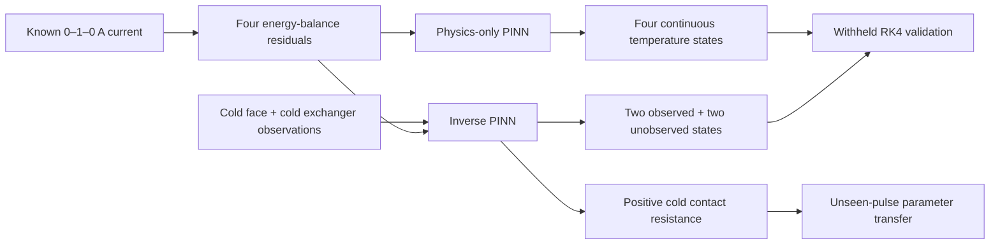

# ThermoTwin PINN Showcase

## Physics-only prediction, inverse calibration, and transfer to unseen controls

This case study is the shortest reproducible demonstration of what the current
ThermoTwin PINNs can do. One command trains two switched-current neural models,
validates them against withheld RK4 trajectories, and produces a focused
six-panel evidence figure.

The demonstration is intentionally honest about scope. It shows that the PINN
implementation can solve and calibrate the assumed four-node thermoelectric
model. It does not yet show that those equations match hardware.

## Run the showcase

From the repository root:

~~~bash
python3 -m thermotwin.pinn_showcase
~~~

The default CPU-first run performs 5,000 forward epochs and 8,000 inverse
epochs. It writes the reproducible figure to:

~~~text
thermotwin/figures/PINN_SHOWCASE/pinn_showcase.png
thermotwin/figures/PINN_SHOWCASE/pinn_showcase.json
~~~

The lower-level forward-PINN comparison uses the same walkthrough folder and
writes `forward_pinn_comparison.png` plus `forward_pinn_comparison.json`.

The generated figure is ignored by Git because it can be recreated from the
committed code. Use `--output PATH` for a deliberate alternate destination.

## The physical experiment

The modeled thermoelectric assembly has four temperature states:

- cold thermoelectric face, $T_{cf}$;
- hot thermoelectric face, $T_{hf}$;
- cold heat exchanger, $T_{cx}$; and
- hot heat exchanger, $T_{hx}$.

The training input is a 60 s rectangular current pulse:

~~~text
0--5 s: 0 A  |  5--20 s: 1 A  |  20--60 s: 0 A
~~~

Current changes instantaneously in this idealized input. Temperatures remain
continuous because the four nodes have finite thermal capacitance, but their
rates may jump. ThermoTwin assigns one smooth neural subnetwork to each
constant-current interval and chains all four endpoint temperatures exactly.

## Evidence 1: physics-only forward prediction

The first PINN receives:

- the known current schedule;
- the fixed physical parameters and boundary inputs;
- the exact initial temperature state; and
- the four differential-equation residuals.

It receives **zero temperature labels**. Dense RK4 temperatures are generated
separately and withheld until validation.

| Withheld state | Physics-only PINN RMSE |
| --- | ---: |
| Cold face | 0.008862 K |
| Hot face | 0.001989 K |
| Cold exchanger | 0.009327 K |
| Hot exchanger | 0.004628 K |

The maximum constructed temperature jump at the two current switches is
exactly 0 K. This shows that the neural representation respects the modeled
state continuity while allowing one-sided temperature rates to differ.

## Evidence 2: inverse calibration from a deliberately wrong start

The inverse PINN receives ideal cold-face and cold-exchanger measurements every
1 s. It does not receive hot-face or hot-exchanger temperature labels. It
jointly learns:

- three exactly joined four-temperature subnetworks; and
- one positive cold thermal contact resistance shared across all segments.

The resistance starts at 0.50 K/W while the hidden synthetic truth is
0.25 K/W—a 100 percent initial error.

| Calibration result | Value |
| --- | ---: |
| Initial resistance | 0.500000 K/W |
| Hidden truth | 0.250000 K/W |
| Piecewise inverse-PINN estimate | 0.250519 K/W |
| PINN relative parameter error | 0.208 percent |
| Conventional scalar estimate | 0.250000 K/W |
| Maximum temperature jump | 0 K |

The conventional estimator receives exactly the same pulse observations. It is
more accurate in this controlled one-parameter problem because it repeatedly
solves the fixed RK4 equations and optimizes only one scalar. The PINN must
simultaneously approximate four continuous functions and the parameter.

## Evidence 3: unobserved state reconstruction

Only the two cold-side states enter the observation loss. The hot states are
constrained indirectly through the energy balances and thermal coupling.

| Dense training-pulse state | Inverse-PINN RMSE | Used as a label? |
| --- | ---: | --- |
| Cold face | 0.006704 K | Yes, at 1 s intervals |
| Hot face | 0.002868 K | No |
| Cold exchanger | 0.001797 K | Yes, at 1 s intervals |
| Hot exchanger | 0.002624 K | No |

Accurate hot-state histories are therefore a withheld test of the physical
coupling, not a direct curve-fitting result.

## Evidence 4: transfer to unseen controls

The inferred resistance is inserted into the conventional four-node solver for
two current schedules that were not used during inverse training.

| Held-out experiment | Current pattern | All-sensor RMSE |
| --- | --- | ---: |
| Validation pulse | Lower-amplitude unipolar pulse | 0.000322 K |
| Test pulse | Multi-switch bipolar pulse | 0.000534 K |

This transfers the inferred **physical parameter**, not a neural trajectory.
The learned training network has fixed switch locations and is not presented as
a universal control-conditioned surrogate.

## What demonstrates the PINN's value

The current evidence does not claim that a PINN beats a scalar optimizer on a
simple same-model problem. Its demonstrated value is the unified
differentiable representation:

1. physics alone produces continuous estimates of four coupled hidden states;
2. partial observations and the same physics jointly identify a positive
   physical parameter;
3. unobserved temperatures are reconstructed without using them as labels;
4. exact state continuity is preserved across discontinuous inputs; and
5. the inferred parameter remains useful under unseen control schedules.

That foundation is useful for later problems where several states or
parameters are unknown, observations are incomplete, or repeated conventional
simulation becomes more expensive. Those advantages have not yet been proven
for the present small lumped model.

## Matched sparse/missing-data follow-on

The later
[`FORWARD_RECONSTRUCTION_COMPARISON.md`](FORWARD_RECONSTRUCTION_COMPARISON.md)
now tests the previously missing comparison directly. Identically initialized
physics-informed and data-only networks receive the same sparse noisy exchanger
temperatures, with both sensors absent around turn-off and both module faces
hidden throughout. Across five trials, physics reduces missing-exchanger RMSE
by 87.86%, hidden-face RMSE by 99.68%, and independent post-training
energy-rate imbalance by 99.19%.

The data-only network still fits the retained noisy rows slightly better and
trains about 3.8 times faster. The follow-on therefore identifies a specific
benefit—physically constrained gap and hidden-state reconstruction—rather than
asserting general PINN superiority.

## What this showcase does not establish

- The synthetic truth uses the same equations as both estimators.
- No hardware data enter training or validation.
- Module coefficients are constant with temperature and current.
- Only one physical parameter is inferred.
- This original showcase uses ideal observations without noise, bias, lag, or
  missing readings; the matched follow-on adds noise and structured
  missingness.
- It does not quantify parameter uncertainty or simultaneous identifiability.
- It does not compare computational cost against every conventional approach.

These are boundaries on the claim, not hidden qualifications.

## Reproducibility and deeper study

The showcase composes existing tested workflows rather than maintaining a
separate set of equations. The detailed derivations and limiting cases are in:

- [`README_detailed.md`](README_detailed.md)
- [`CONTACT_RESISTANCE_EXPERIMENT.md`](CONTACT_RESISTANCE_EXPERIMENT.md)

Run the complete regression suite with:

~~~bash
python3 -m unittest discover -s tests
~~~
